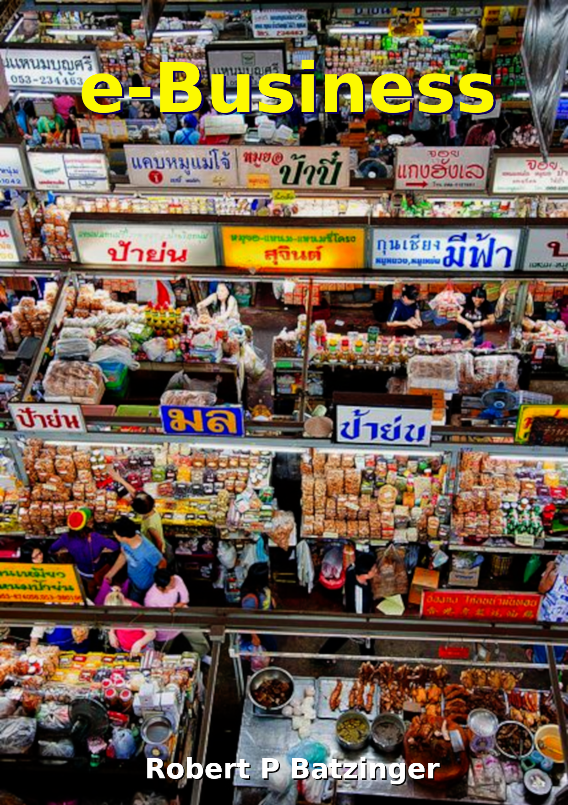
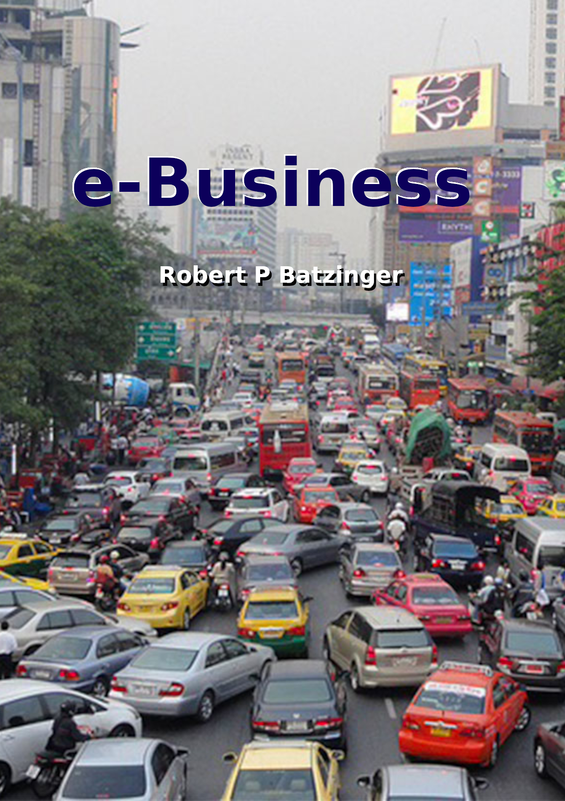

# e-Business
A project to develop the slides, textbook, activities, and online courseware for an undergraduate course offered to students of computer science (CS), software engineering (SE), and informatics (IT).

## Course goal:

* To introduce CS, SE,and IT students to the principles of business and its associated data requires.

* To help students to explore the nature of key business software applications and identify and extract data assets they generate.

* To help students integrate data resources to create management information systems that provide useful insights and predictions based on the data collected.

## Possible cover illustrations

1. Floating Market, Bangkok.

2. Chinese Resturant Kitchen, Shanghai.
    

3. Floating Market, Phuket.

4. Fried Snack Production, Chiang Mai.

5. Bangkok Streets

6. Jao Payao River, Bangkok.

7. Wararot Market, Chiang Mai.

8. Singapore Financial District.

9. Bangkok Traffic.
   

10. Bangkok Traffic.

11. Singapore Skyline.

12. Singapore Traffic Circle.

