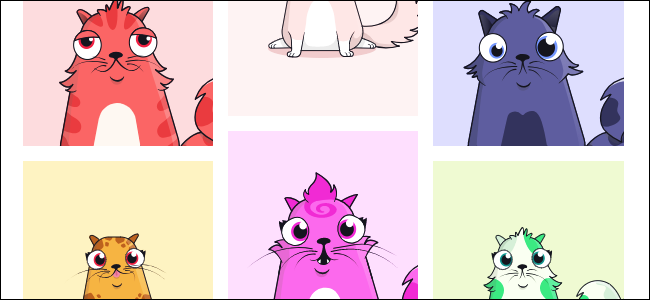

# Emerging Technologies

This is a test

## Business Intelligence and Data Analytics

* Data dashboarding
* Big Data
* Data Science
* Machine learning and AI

## Block chain

### Cyptocurrencies

### Other applications of block chains

Another test ^[Available online at https://www.cryptokitties.com]

\BeginKnitrBlock{rmdstudy}

**The Crazy Expensive CrytoKitties**

 
CryptoKitties is a "blockchain game". It involves collecting, trading, and breeding CryptoKitties with "cattributes." These kitties are actually tokens stored on a blockchain. A CryptoKitty is a unique digital asset that is stored as a token stored on the Ethereum blockchain.[@TCT2018] Each CryptoKitty has a combination of cattributes that make it unique. These features come together to give each CryptoKitty a unique look. Some CryptoKitties have mewtations, which are rare cattributes. These CryptoKitties can be traded, sold, and purchased like any other digital asset. They can also be bred with another CryptoKitty to create a new kitty. On the surface, CryptoKitties is just a game that involves collecting digital cat pictures, breeding them to make new cat pictures, and trading cat pictures. The first CryptoKitty was born on December 2, 2017. Since then, a new Generation 0 cat has been born every fifteen minutes. In November 2018 (one year after the game launch), the last Generation 0 cat will be born. All new kitties will be produced through breeding after that point. As collectibles, they have rarity: each CryptoKitty is unique. The most expensive CryptoKitty ever purchased sold for \$110,707 to a willing buyer. People have spent over $\$$24 million on CryptoKitties, and the project has received \$12 million in venture capital funding.[@Hoffman2018]

\EndKnitrBlock{rmdstudy}

## Open Source Solutions

In 1983, Robert Stallman wrote the core concepts that would eventually become the GNU Manifesto as an means to initiate a movement committed to creating and distribution open and free software.[@Stallman1985] The Free Software Foundation grew out of these developments and granted users the following four freedoms, many of which require access to the source code.

* **Freedom 0:** The freedom to run the program, for any purpose.
* **Freedom 1:** The freedom to study how the program works, and adapt it to your needs. Access to the source code is a precondition for this.  Access to the source code is a precondition for this.
* **Freedom 2:** The freedom to redistribute copies so you can help your neighbor.
* **Freedom 3:** The freedom to improve the program, and release your improvements to the public, so that the whole community benefits. Access to the source code is a precondition for this.[@FSF2018]

## Thailand 4.0

Thailand 4.0 is an economic model that aims to unlock the country from several economic challenges resulting from past economic development models which place emphasis on agriculture (Thailand 1.0), light industry (Thailand 2.0), and advanced industry (Thailand 3.0). These challenges include economic conditions that create 3 traps:

* **A middle income trap:** where opportunities for wealth accumulation is restricted.
* **An inequality trap:** where wealth is not acquired fairly based on gender, ethnical background and other socio-political issues.
* **An imbalanced trap:** where the gap between the rich and the poor widens especially based on geographic location and  urban vs rural settings.

The Thai government has committed itself to invest into several areas of innovation that would stimulate the economy, such as robotics/internet of things, agriculture/biotechnology, biofuels/biochemicals and smart electronics.[@TMC2016] The intention is to create the environment for transformation and resulting sea-changes in such areas as farming, business development, skilled labor and technological development. The four objectives of this strategy are listed below:[@RTE2016]

1. **Economic Prosperity:** to create a value-based economy that is driven by innovation, technology and creativity. The model aims to increase Research and Development (R&D) expenditure to 4% of GDP, increase economic growth rate to full capacity rate of 5-6% within 5 years, and increase national income per capita from 5,470 USD in 2014 to 15,000 USD by 2032.
2. **Social Well-being:** to create a society that moves forward without leaving anyone behind (inclusive society) through realization of the full potential of all members of society. The goals are to reduce social disparity from 0.465 in 2013 to 0.36 in 2032, completely transform to social welfare system within 20 years and develop at least 20,000 households into Smart Farmers within 5 years.
3. **Raising Human Values:** to transform Thais into "Competent human beings in the 21sth Century" and Thais 4.0 in the first world. Measures under Thailand 4.0 will raise Thailand HDI from 0.722 to 0.8 or the top 50 countries within 10 years, ensure that at least 5 Thai universities are ranked amongst the world's top 100 higher education institution within 20 years.
4. **Environmental Protection:** to become a livable society that possesses an economic system capable of adjusting to climate change and low carbon society. The targets are to develop at least 10 cities into the world's most livable cities, reduce terrorism risk, and increase the proportion 

## Working remotely

Technology has change the nature and function of the workplace according to 2 major trends:

1. The office has become a collaborative space to stimulate brainstorming and collective problem solving. By providing support for group work within both formal and informal settings, a development team is encouraged to use collective intelligence and skill of a work group to solve problems of multiple dimensions and disciplines. The emphasis is on solving problems quickly and effectively.

2. Individuals work remotely from locations and timezones of their choosing. This allows workers to better use their time and resources in accomplishing their work. Workers use telecommunications and teleconferencing to meet with colleagues to address specific issues, collective message boards and file shares are used to hand off materials and to measure progress.

Both work environments require diligent, highly-skilled, motivated and results-driven teams of workers.

### Reasons for working remotely

Here are key reason given by digital nomads and their employers for working remotely. Simply put: Working remotely is the best. But what is it that makes remote jobs so great exactly? In a word: freedom. "Whether you want to enjoy some stunning scenery on a daily basis, need to be near family to help out or keep connections strong, are looking to cut down on your cost of living, or have always dreamt of truly nomadic lifestyle, remote work makes it possible," says Skillcrush people ops manager Kelli Smith.

https://skillcrush.com/2018/09/13/reasons-to-work-remotely/

1. You can actually focus. Eliza Barry, marketing director at Amata Solutions, says the office became totally unproductive for me due to constant interruptions that would turn into long conversations. It was not uncommon to have an employee send an email with a quick question about a marketing idea they had, and then follow up that email within minutes by dropping into my office to chat about it. I simply did not have time to deal with the influx of requests and repeated conversations about frequently asked questions that had been covered in emails. Now, she can maintain her focus, fend off distractions and Get. Stuff. Done. A study from Stanford University showed that working from home increased productivity by 13 percent. So, want to get more done and ditch the interruptions? You know what to do.

2. Naps are a serious option. "I own an office in town, but I work remotely four out of five days per week, so I can take a nap halfway through the day," says Max Robinson, owner of FishTankBank. "Since I started working naps into my daily work regime, it has totally changed my productivity for the better. Unfortunately it's not quite socially acceptable to take naps in offices, so I choose to work remotely from home and have them here instead!"

3. You can prioritize your mental health. Checking out is key to keeping your mental health in check, and there are some days you wake up and need to recharge, says Levi of G2 Crowd. Certain personality types need that more than others, he says, so if you're the type that needs some time to refuel, remote work is for you.

4. You can save money. Alex Robinson, General Manager at Team Building Hero, works with people who live in high cost cities like New York City, Boston, and San Francisco, but Robinson says "I prefer to live and work from small cities where my rent is less than 50 percent of those major cities. This lower rent means I have more room in my budget for travel." Want to travel like Robinson, save for an emergency fund or house, or simply have more fun money? Remote work is the answer.

5. It's easier to be a working parent. "I can easily navigate school delayed openings, half days and holidays, and be at school to pick up a sick child in ten minutes. I can get back to work on an unfinished project after the kids go to bed, or while waiting for them at sports practice," says Cynthia Meyer, resident financial planner at Financial Finesse. "The guilt of putting family in the backseat due to work commitments is something I have never come across thanks to my remote work. I would never want to miss my daughter's first steps because I was caught up in a work meeting!" says Sireesha Narumanchi, founder at Crowdworknews.

6. Your access to the job market isn't limited by where you live. "I live one hour south of Boston. Being someone who is into writing, SEO, and marketing, it means all the jobs are there. The question basically comes down to, am I willing to commit two to four hours a day of driving, on top of my work hours, for a job? What does my life look like if I do that five days a week?" says Nicholas Rizzo, Training Research & Writer, RunRepeat.com. The answer was clear for Rizzo: Go remote and stop being limited by where he lives. The same goes for Michelle Klieger of Stratagerm Consulting, LLC. "My education, experience, and passion is in the field of agriculture. However, I recently moved to New England to be close to my family. The New England agriculture industry is small and niche, with limited openings. So, working remotely provides me the best of both worlds, access to great career opportunities and a closeness to my family," she says.

7. You can escape the open office plan. Open offices seem like the future, but they're a pain for productivity. Lauren Morley, chief marketing officer at Techvera, says that her company's open office was a nightmare [in terms of] getting anything done. My train of thought was always flying off the tracks and it was hard to be as productive as I wanted to be. Maybe you can relate: I would frequently leave an eight hour day feeling like I barely accomplished anything, she says. But remote work changed everything: I've noticed I'm much calmer and less stressed, and my output and quality of work has improved. I feel and look healthier. I've learned how to be a better self-motivator and effective communicator. I absolutely love working remotely and I don't know if I could ever go back to office life, Morley says.

8. You can work from wherever you want. I spent many years working in a windowless hospital office with fluorescent lights and felt very disconnected from the outdoors. Now, I am living in my teardrop camper traveling across the U.S. with my Verizon hotspot for internet access. And best of all, in my downtime I get to explore the beautiful outdoors with my husband. Right now, we're in upper Michigan and we're heading to Colorado and Southern Utah next. I love working remotely and will never go back to the old way of doing things! says Sarah Stromsdorfer, occupational therapist and founder of My OT Spot

9. You can meet your physical needs more easily. I work remotely because as I get older, I need to manage my energy levels and workload more, says Neil Pope, CEO of Game On Music. If I feel like sleeping in and starting late I can, which gives me the freedom to work with maximum efficiency when I am at my most productive, he says.

10. You can make your own schedule. Working remotely gives me freedom over how I spend my time, says Danielle, UX/UI Designer at Studio Moku. I often work four hours in the morning, enjoy the day and work four more hours at night. Work best at 2:00 a.m.? It's within reach!

11. You can live wherever you want. Annie Pagano, marketing coordinator at Interpreters and Translators, Inc., says I work remotely because I get to live in a state that I love (Colorado) while continuing to work for a company that I love and have worked with for seven years. They are based in Connecticut which is where I am originally from and my family still lives. Whenever I travel for meetings or to work out of the home office, I get to visit with my family and friends. It's a complete win/win!

12. Your office is your own. It's great to work remotely, because it allows employees to create a work environment that is conducive to putting out their best work. You're also typically able to control the noise level and concentrate in your own home, says Shilonda Downing of Virtual Work Team LLC. Don't just stop at noise level: Go for temperature, soundtrack, and office decoration. You're in charge!

13. Avoid the commute. In a major city a commute can easily be 30-90 minutes, and I prefer to use this time for productive work at my home office, says growth marketer Michael Alexis. Commuting isn't just bad for you (and it is: long commutes have been shown to be detrimental to your health and increase stress levels), but those drives negatively impact the environment, too. Extra bonus: The time you save as a remote worker is yours to use on anything you want. I've used these sessions for side projects that help push my career forward and work toward promotions, Alexis says.

14. You can travel all the time. Theres good news if you've got the travel bug. Being a remote worker means you're completely untethered. Working remotely gives me the opportunity to travel full-time. I can explore any place with good internet access, which in today's world is almost everywhere. I love that I can take my job with me anywhere in the world and combine my passion for teaching with my travel ambitions, says Nicola Rae, English teacher at VIPKID.

15. You can better serve your customers. Substance use counsellor Annina Schmid works remotely and can offer specialized services such as eating disorder and substance use counselling to people in remote areas that wouldn't otherwise have access to this kind of support. This allows her to help more people, and opens up a client base all over the world.

16. You can work alone. I'm an introvert, and like all introverts, I couldn't stand open office plans, says Lucio Buffalmano, founder the ThePowerMoves. Are you similarly averse to small talk? Working remotely can make socializing a non-issue.

17. You can keep things interesting. I work remotely because it gives me the opportunity to meet new people and see new things every day, says journalist and content creator Hilary Sheinbaum. Having a change of atmosphere also keeps me on my toes. I'm never bored with the same old environment, she says. This kind of pattern disruption can boost creativity and inspire new ideas, says Remote Bliss Rebecca Safier. As a result, employees might be more innovative and take more initiative, which benefits their personal growth and the company they work for alike, she says.

18. Ditch the professional clothes.
Career coach Jill Ozovek points out that there is no need for a dress code when you work remotely, so you can spend all day in athleisureor even pjs is that's your thing. Bonus: You'll save money on a work wardrobe, since professional clothes do not come cheap.

However, remote worker must still produce results on time and on budget. To do that they need to take time and project management seriously. Also it is important to maintain regular effective communications. Being off campus can make one feel forgotten or ignored if communication is not 2 way on a regular basis.
   
