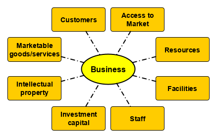

# GENERAL PRINCIPLES

```{r, out.width='90%',echo=FALSE,fig.align='center'}

```

As an introduction to the context suroundingt e-Business, this chapter will explore the nature, need and management of business processes and  components.

\newpage

## Essentials of Business

Business is a set of interactions in which goods and services are provided and compensation is rendered.
In essence, businesses developing the means for acquiring marketable goods or servies that customers will purchase in sufficient qualities to make the endeavor worthwhile. Ideally, a start-up aims to seek fair compensation for goods and services rendered in the most effective and efficient manner.
Businesses become sustainable when the compensation meets the short-term and long-term requirements of the business. Most business fail because of an inability to develop and maintain a market demand that leads to sales that meet or exceed their expenses. Balancing the demands and requirements of each component of business requires timely management decisions based on accurate information. As the speed and volume of businesses grow within the gloabl economy, rapid communication and acknowledgement of detailed information has given rise to many e-Business practices and applications designed to support the operation and growth of business. This book will attempt to explore the context and use of common e-Business techniques and applications. The following sections will help to describe the context of IT services within a modern large scale enterprize, particularly those operating in Thailand.


```{block2,ex.nature-business, type='rmdexercise'}
**Exercise: The Nature of Business**

Discuss how the following premises would impact the nature, as well as the potential for long-term success of  businesses.

1. Business is all about making lots and lots of money quickly by any means possible.
2. Business is about fair compensation for goods and service to both suppliers and customers.
3. Business is the process of copying the industry leaders to provide similar goods and services at a fraction of the cost.
4. Business provides special opportunities for myself, my friends and relatives at the expense of our customers.

```

### Business processes

Individual businesses are generally centered around a core set of goods and services which address the specific needs of clients creating a sense of value and desire. Good design and pre-market testing help to define the nature of the products and services. At the same time, controlling production and distribution costs make it possible to deliver goods and services at a suitable price point for customers to consider purchase. Careful supply chain and operations management develops a network of contracts and business transactions with suppliers and distributors that ensures that the flow of materials, products and cash occur on time and on budget. 


```{block2,ex:marketprinciples, type='rmdexercise'}
**Exercise: Match market principles to market characteristics**

|   Principles |    Characteristics |
|--------------|----------------|
| (A) Access to market <br>\newline(B) Brand recognition<br>\newline (C) Customer pool<br>\newline(D) Investment capital<br>\newline(E) Resources<br>\newline(F) Market value |  ___ Consumer preference<br>\newline  ___ Supply of raw materials<br>\newline ___ Distinctive goods and services<br>\newline ___ Investors and stock holders<br>\newline ___ Location and traffic<br>\newline ___ Steady market demand |

```

### Core Activities of a Business

Business requires coordinated teamwork of specialists in various departments to achieve efficiency and effectiveness on a large scale. 
 
* **Finance:** mid-term and long-range financial planning to ensure that there is an adequate supply of money available to 
* **Accounting:** a record of financial commitments and compensations for the purpose of tracking movement of value across the organization and throughout the production process
* **Marketing:** getting groups of potential customers and consumers interested in products and services. 
* **Sales:** selling products and services to customers maintain records to assist forecasting future demand and market growth
* **Operations:** systems to acquire resources, produce, package and deliver products
* **Management:** sets the direction and pace of business endeavors

### Support functions

As businesses grow in size, various support functions are required to keep the core business running. These functions include the following:

* **Management Information Systems:** collect, analyze and distribute mission-critical information to key administrators
* **Human Resources:** attract, hire, train and retain effective employees
* **Legal Department:** ensure compliance with laws and regulations
* **Investor Relations:** communications with shareholders to attract support and investments
* **Customer Relations:** after sales care of customers and encouragement of brand loyalty
* **Facilities Management:** maintenance of facilities and equipment to maximize the utility and value of capital investments in equipment and infrastructure.

```{block2,ex:concepts1, type='rmdexercise'}

**Exercise: Key business concepts**

Create a mindmap that illustrates the relationship between the following sets of terms, along with their Thai translations.

* **Key business components:** Access to market; Resources; Value; Investment capital; Marketable goods and services; Customers 
* **Core business activities:** Finance; Accounting; Marketing; Sales; Operations; Management.
* **Support functions:** Management information systems; Human resources; Legal department; Investor relations; Customer relations; Facilities management

```


## Understanding the role of IT in business

As IT Departments become integrated into the business strategy, they provide tools, information and communication systems that can play a transformative role in the nature of the business. Enterprise Architecture tend to grow as IT Department move along these evolutionary steps. [@Hohpe2017a], [@Hohpe2017b]

### The Establishment of an IT Department

1. Understand the business strategy
2. Translate into an IT strategy
3. Create transparency for IT developments
4. Define IT target picture
5. Define the roadmap for implementing IT
6. Harmonize and govern
7. Obtain feedback and refine
8. Coach and mentor

Among IT Managers, there appears to be 2 major approaches to understanding the nature of business and IT's function: using IT to redesign the business or engineering the current organization. The political implications of the approach chosen can be immense and often the success of an IT manager will depend on the level of support from those that manage the IT department manager.

|Architecting the Business | Reverse-Engineering the Organization |
|:----------------|:-----------|
|* Identification of growth areas |* Divisions and business lines |
|* Profitability of goods and services |* Group level vs divisions |
|* Geographic/demographic opportunities | * Reportings lines |
|* Geopolitical aspects | * Matrix organizations |
|* Acquisitions and divestitures | * Hidden org chart/loyalties |

### Business views of the role of IT

Business managers have 4 main approaches to managing IT based on the main focus of the business administration.


| **Focus** | **Role** | **Reports to** | **Common stragegy** | **Levers** |
|---------:|:---------:|:---------------:|:----------------|:---------------:|
| Cost of IT  |  Cost Center | CFO | Outsource IT |  Cost cutting |
| Return on investment | Asset | COO | Harmonize / Rationalize | Economies of scale |
| Business value of IT |  Partner |  CDO |  Insource IT |  Economies of Efficiency |
| Speed / innovation | Enabler |  CEO | IT = business | Economies of Speed |


IT Strategy provides a road map of where IT developments and operations are going. This is derived from an understanding of the nature of the business and is not restricted by current realities. The IT strategy is as much a definition of what IT intends to do as well as what it will not do. Above all, an effective IT Business strategy does not conform to a vendor's product road map. However, successful strategies must recognize the IT Operating Model that the business gives to IT. [@Ross2006]

**IT Operating Models**

| Integration | Minimal Standards | Highly Standardized |
|:-----:|:---------------------|:---------------|
|High | **Coordination**       | **Unification** |
|     |* Unique business units<br>\newline * Examples: Merrill Lynch, Toyota<br>\newline * Key IT capability:<br>\newline &nbsp;&nbsp; - access to shared data<br>\newline &nbsp;&nbsp; - standard technology interfaces | * Single business with global standards<br>\newline * Examples: Delta Airlines, Pepsi<br>\newline * Key IT capability:<br>\newline &nbsp;&nbsp; - enterprise systems to reinforce<br> standards<br>\newline &nbsp;&nbsp;- provide access to global data |
|     |                       |                 |
| Low | **Diversification**   | **Replication** |
|     | * Independent business units<br>\newline  * different customers/expertise <br>\newline  * Examples: Johnson & Johnson, GE <br> * Key IT capability:<br>\newline &nbsp;&nbsp; - provide economies of scale <br>\newline &nbsp;&nbsp; - do not limit independence | * Independent but similar business units<br>\newline * Example: Marriott, CEMEX<br>\newline * Key IT capability:<br>\newline &nbsp;&nbsp; - provide standard infrastructure and app<br>\newline &nbsp;&nbsp; - maximize global efficiencies |


### Software to facilitate business interactions

As a business grows, so does the complexity of the interactions between its departments. There is a complex web of interactions within a modern business organization. Management focuses on the control, operation, and development of a business. Financiers use investments to maximize opportunities to grow the business.  Production engineers tune the processes needed to deliver products, But the key concern for IT is the nature and volume of information to be analyzed, shared and communicated in a timely fashion,
as shown in the following diagram:


Even with over 50 years of intensive development to reduce the complexity of doing business,  new software tools and apps are still emerging at an astounding rate. The following sidebars attempt to classify common software systems found in medium to large size enterprises into 2 basic types of business systems.

* **Enterprise Resource Planning (ERP):** data systems that store and communicate operational data in a way facitates reporting and future planning.

* **Enterprise Resource Management (ERM):** software systems that facilitate the monitor and manage interaction and the use of resources.


```{block2,st:erp, type='rmdextra'}
 
## ERP Software Systems {-} 

* **CONTENT MANAGEMENT SYSTEM (CMS):**

  * Collections of guides, rulebooks, forms, and procedure guidelines
  * Blogs, newsletter, announcements
  * Catalogues, price lists
  * Documentation of intellectual property and licenses
  
* **PRODUCT INFORMATION MANAGEMENT (PIM):**

  * Manual, troubleshooting guides
  * Parts list, equivalences
  * Price lists and stock inventory
  * Photos and promotional materials
  
* **Accounting Information System (AIS):**

  * Revenue: cash inflow (sales)
  * Expenditure: cash outflow (payroll, equipment)
  * Conversion: work-in-progress transactions (raw material, precursor inventory)
  * Administrative: reporting (income statement, balance sheet, cash flows)

```


```{block2,st:erm, type='rmdextra'}

## ERM Software systems {-}

* **B2B: Business-to-business software:** manages workflow with suppliers and partners

   * Directory of suppliers and products
   * Social media confirmation of quality
   
* **B2C: Business-to-consumer software:** serve the needs of individual customers particularly in regards to customer history, order status, and billing information.

   * Online store
   * Product manuals, product information
   * Delivery tracking

* **Human Resources Management (HRM):** 

  * Payroll, bonuses, raises
  * Staff work experience, Performance appraisal, skill tests
  * Flight risk, employee satisfaction
  * Education, training

* **Marketing Automation Platform (MAP):** 

  * CRM: Customer Relationship Management - purchase history, rewards, interests, 
  * MCP: Marketing Campaign Planning - Ad words, analytics, costs, contracts, effectiveness

```
  
## Essentials of Business Quality Management

Businesses are driven by an active communication chain that drives the business process. The effectiveness of teamwork and management depends on effective communication. However, the communication chain can be interrupted by bottlenecks in the flow of data, inconsistent or misleading reporting, and other communication breakdowns. Quality standards help ensure that processes related to production and quality control are subject to timely, data-driven management. In essence the ability of a business to fix a problem depends on the quality of communications that provide access to the description of the true nature and extend of the problem and knowledge of possible remedies. 


Meaningful communication requires a reciprocal interaction between the speaker and the listener. As shown in the following table, social norms and good ethicate depend on transmission of a message and an appropriate response. The communication chain is lost when messages in either direction are lost or misinterpreted. The growing use of social media with its emphasis on icons or one word responses has often been blamed for the reduction in quality of personal verbal and written skills. Interaction with customers and suppliers depends on clear and effective communication. 

| Initiation message | Response message |
|-----------|-----------|
| Greeting | Acknowledgement |
| Question | Response |
| Proposal | Acceptance/Rejection |
| Command | Action |
| Accusation | Acceptance/Rebuttal |

### ISO9000/ISO9001

ISO 9000 was first published in 1987 by the International Organization for Standardization (ISO). The derivative quality standards help organizations address the needs of customers and while meeting relevant statutory and regulatory requirements.[@ISOweb]  The ISO9001 standards provide guidance and tools for companies and organizations who want to ensure that their processes regularly deliver products and services that meet customer’s requirements. It also defines the requirements for certification against these standards which are reviewed and revised every 5 years.[@ISO2015]

* **Point 1: Clear customer understanding** of the goods or services offered within a business contract.
* **Point 2: Verification of intended results** to ensure that the terms of the business contract were met.
* **Point 3: Prevention of undesired effects** that might cause delays or problems in the delivery of goods and services
* **Point 4: Improve performance** based on the information gathered


```{block2,ds:9001, type='rmddiscussion'}
**An example of an ISO9001 compliant transaction**
  
Discuss what points of the ISO9001 standard is satisfied by the follow stages of a simple business transaction at a restuarant.

1. The customer enters a restaurant and is given a menu with pictures of the food.
2. The waiter takes the order and repeats the order back to the customer for confirmation.
3. The waiter brings the food and doubles check that the order is complete.
4. The waiter comes back to check if everything is okay.
5. The cashier checks that all was well when the bill is paid.
6. The whole transaction is recorded and the receipt gives a website for feedback.
7. The customer's feedback on the website is analyzed for patterns of service that could be improved.


```

```{block2,ex:9001, type='rmdexercise'}

**Exercise: ISO9001 and MacDonalds**

Worldwide MacDonald is a successful multinational enterprise run by staff most of which are under the age of 21 and yet it is a certified ISO9001 company. When a customer orders food at any MacDonald outlet in the world, the interaction between the customer and the counter staff is always the same. 

* Create a swim lane workflow diagram to describe the information flow in the conversation between the customer, the counter staff, the kitchen staff, the accounting system, and the point-of-sale computer system. 
* Identify how the basic principles of ISO9001 principles for quality management are a ddressed by this basic operating procedure..

```

## Changes to Business

Businesses today have unprecedented opportunities to rapidly address issues that arise. Such advances in such fields as deep machine learning, Big Data analytics, Internet of Things, collective intelligence, online payment and social media are creating a reality that was only hinted at by the 1999 book ***Business at the speed of thought.*** [@Gates1999] Businesses that were market leaders in the past, but failed to keep pace with the changes, suddenly find themselves bankrupt and replaced by new competitors. In 500BC, Heraclitus of Ephesus once penned the warning that "Change is the only constant in life" but he words ring true as an accurate description of today's business environment.    

### Open Organization

Since ISO9000 was first published in 1987, it has been revised and replaced by a long list of international standards that define and specify how various aspects of business, hardware, and software are to be implemented. Each new standard built on the principles already established and addresses the weaknesses of previous standards. [@ISO2015] While these developments help to ensure consistent service and quality, something else was needed to empower staff to collectively think and implement creative solutions to challenges. Jim Whitehurst at RedHat.com invested considerable effort to address this problem. He started with the realization that "the best practices in creating open source software also translate well into managing an entire company." By embracing open source values and creating a new open standard for communities, he showed how leaders can successfully create "a rebooted, redesigned, reinvented organization suitable for the decentralized, empowered, digital age."[@Whitehurst2015]  In creating the open organization, he and his colleagues have documented a shift that is changing in the way businesses are organized, managed and run.


| Traditional values | Post-Modern values |
|-------------|-------------|
|Loyality to the organizational hierachy | Loyality to the mission, purpose and values of the company |
| Compliance | Focus creativity to create solutions |
| Predictability | Adaptability to change |
| Efficiency | Effectiveness |
| Plan, Prescribe, Execute | Envision, Prioritize, Implement, Adjust |


Successful, innovative organizations demonstrate the following core principles which form the basis for the core elements of open organizations. [@Whitehurst2019]

* The best ideas come from anywhere.
* The best ideas should always win.
* Contribution matters more than title.


Although every open organization is unique, there is a common core of elements that characterize open organizations. Each core element is composed of a different dataset to be gathered, distributed, and combined in powerful and productive ways.

* **Transparency:** Workers have access to all pertinent information and willingly disclose and discuss their work. Workers can access and review the processes and arguments that lead to decisions and are free to comment and respond to them. Successes and failures are valued for the lessons they provide.
* **Inclusivity:** Protocols and procedures are developed to encourage constructive discussion from diverse perspectives. Leaders actively seek to include voices not present in the dialog. Technology is used to ensure and encourage access to discussion forums.
* **Adaptability:** Feedback mechanisms provide access for suggestions from members of the organizations and outside members.
* **Collaboration:** The organization adheres to the principle that working together produces better results. Products of development are made available to other projects to use creatively.
* **Community:** Shared values and principles that guide decision making are clear and obvious to members of the organization. All workers are encouraged and empowered to make meaningful contributions to the collaborative effort. Leaders mentor others and model shared values and principles.


As organizations embrace the core concepts of open organizations, they discover that openness is necessary for success and that attempts to pursue openness will lead to 3 possible outcomes: [@OOA2017]
  
* **Greater agility:** resulting from the synergy that arises when members share a common vision and work together toward common goals.

* **Faster innovation:** because ideas from both inside and outside the organization receive more equitable consideration and rapid experimentation

* **Increased engagement:** as members clearly see connections between their particular activities and an organization's overarching values, mission, and spirit.


```{block2,st:workingoo, type='rmdextra'}

## Working as a developer within an open organization {-} 

Increasingly large IT development center like Google, Oracle and Apple are becoming open organizations to encourage and value innovation. Each worker in those companies is expected to do his/her part in contributing to the development effort. However, young IT staff have a very high rate of turn over as they are often foreign to working in environments that productively focus creativity to solve issues. This mismatch was the inspiration behind a recent blog concerning the five laws that development engineers should know. [@Short2017]

1. **Forget the phrase 'I do not know':** Treat every task as an opportunity to learn and dedicate the time needed to become an expert
2. **Read the manual! :** Documentation was written for a purpose. Do not waste colleague's time.
3. **Search before asking:** Do not contribute to the problems but contribute to the solution.
4. **Anything is possible:** Anything is possible in this space with proper time, coordination, and effort. Trust by verifying new ideas 
5. **Acknowledge technical debt:** Technical debt is the result of decisions that made sense at the time someone made them but cause problems because they are not based on reality.


```

### The changing nature of customers

Advances in technology have changed both the ability to produce product and the nature of markets. The internet and social media have exposed individuals to a wider range of products and vendors. This creates new desires and expectations in customers and increased competition among business. At the same time, social changes are impacting markets, particularly as youth explore new careers, lifestyles, technologies, and life goals. 


```{block2,st:success, type='rmdextra'}

**Changing indicators of success in Singapore**

The most common indicators of success mentioned in conversation with Singapore voters in 2000 was compare to the list compiled from conversations with Singaporen youth in 2018. [@SNYCYC2019], [@Tan2019]

|Level | Traditional success indicators | Goals of Singapore Youth|
|---:|:---------------------|:------------------|
|1 | Career / Work          |  Emotional well being  |
|2 | Finance / Money       | Personal learning / Skill development |
|3 | Studies / Degrees     | Family   |
|4 | Family             | Finance / Money |
|5 | House / Belongings   | Spirituality |

**Top 10 Life Goals Important to Singapore Youth**

| Goals | Percent |
|:-------|--------:|
| Home ownership | 70% |
| Strong family relationships | 70% |
| Learning / acquiring new skils | 62% |
| Successful career |  59% |
| Earn lots of money | 46% |
| Help less fortunate | 41% |
| Contribute to society | 40% |
| Get married | 36% |
| Have children | 35% |
| Good religious life | 31% |
  
```

Today's businesses need to be as versatile and diverse as the customers and markets they serve. In the past, only businesses with a large customer base were about to benefit from economies of scale. However, online services have made it possible for businesses to support both mass distribution to millions of consumers while at the same time of catering to the diverse needs of individual customers that number in the millions. 


```{block2,ds:changes, type='rmddiscussion'}

**Discussion: Impact of changes in life goals on business**

1. How do you think changes in life goals of youth will impact the market place?

2. Based on these changes, which products would be expected to have the greatest increases or decreases in demand in the next 10 or 20 years?

3. What aspirations of Thai youth have changed in the last 10 years?

4. What impact will these changes have on the Thai economy?

```


In addition, social media provide a forum for expressing opinions without being held accountable for the view expressed. Generally, the rewards for being liked help to regulate the web but increasing courts are given the power to litigate on defamation cases where rumors have caused damage. Nonetheless, social media continue to have an impact on Brand and Product Marketing,particularly in the following ways.

1. Word-of-mouth referrals from trusted acquaintances are powerful endorsements and attractions.
2. Customer testimonials are often decisive in purchasing decisions.
3. Community discussion of the products being developed increases trust in the company.
4. False testimonies are a problem: fakes entries attempt to oversell a product or provide complaints in an attempt to destroy the company.
5. Online searches and discussions are becoming the primary source of information for most.

```{block2,ds:onlinemarket, type='rmddiscussion'}

Given the changes in the nature of the online market, discuss how the following approaches help to target the population to focus on those who are most likely to purchase. For each of these approaches, identify the nature of a particular market for which it would be more effective than the others.

1. Search engine ads based on topics being searched
2. Social media ads based on shared views and ideas
3. Personal profiling to drive the user experience at a website based on specific interests and preferences expressed

```


### Changing nature of business

It is clear that the retail companies in rapid growth are those who are able to upgrade the services of the traditional storefront into a more convenient, efficient and user-friendly setting that compliments the services available online. Banks have moved their services online and to ATM to increase the convenience of handling money while lowering operating costs. Online companies like Amazon have teamed up with traditional shopping chains like Target to allows customers the opportunity to compare, touch and feel products before purchasing them either in the shop or online. Online orders can be delivered to shops to reduce shipping costs. Amazon has even integrated such high tech features as AI, face recognition and sensor to change the user shopping experience.[@Amazon2016] Technology play a critical role in all of these developments.


```{block2,ds:711, type='rmddiscussion'}

## New generation 7-11 (Seven Eleven) {-}

View this news clip about a new Seven Eleven outlet that opened in Pattaya with a new look that is in keeping with the era of Thailand 4.0. The store is full of sensors, monitors and systems to create a modern, futuristic, efficient shopping and eating environment complete with innovations to improve energy-saving and user convenience. Watch the video [@Suriywong2018] and list the number of ways computers have been used to change the user experience.


```

## Online Commerce


In 2019, it is estimated that over 56% of the world's population has access to the internet. There are 26.6 billion devices and 4.39 billion people are connected to the internet. It is estimated that 3.48 billion social media users. Facebook alone has well over 2.36 billion users each month. Google answers 63,000 searches per second. This is creating unprecented levels of opportunity for marketing to huge markets world-wide. In the following graph, the number of users grows linearly while their revenues grow expotentally. [@Statista2019] 

```{r,echo=FALSE,fig.width=9,fig.height=5}
fbdat = rbind(
c(2004,0.4,1),
c(2005, 9,6),
c(2006, 48,12),
c(2007, 153,58),
c(2008, 280, 145),
c(2009, 775, 360),
c(2010, 2000, 608),
c(2011, 3711, 845),
c(2012, 5089, 1056),
c(2013, 7872, 1230),
c(2014, 12466, 1393),
c(2015, 17928, 1591),
c(2016, 27638, 1860),
c(2017, 40653, 2129),
c(2018, 55013, 2350))

colnames(fbdat) = c("Year",	"Revenue", "Users")

plot(fbdat[,1],fbdat[,2],log="y",main="Facebook Statistics",col="blue",lwd=2,type="l",xlab="Year",
     ylab="Quantity (in millions)")
lines(fbdat[,1],fbdat[,3],col="red",lwd=2)
legend(2011,100,c("Annual Revenue", "Monthly Users"),fill=c("blue","red"))
```

```{block2,ds:phonesales, type='rmddiscussion'}

**The mobile phone market**
Review the statistics of the performance of leading mobile phone producers since 1994 [TNW2019] and discuss the following:

* What factors contributed to the fall of market leaders?
* How will President Trump's technology embargo on China effect this market?
* Is there room for new competitors in this market?


```


### Growth of the Internet and e-commerce

As the following graph shows, the types of devices used to access the internet have also changed in the past decade.

```{r,echo=FALSE,fig.width=9,fig.width=7}


devicedat = rbind(
c(2010,157,201,19,302),
c(2011,155,209,76,488),
c(2012,148,201,145,725),
c(2013,134,180,219,1004),
c(2014,134,174,230,1167),
c(2015,114,163,208,1290),
c(2016,103,157,175,1432),
c(2017,98,161,163,1472),
c(2018,94,162,150,1405),
c(2019,88,166,137,1240))


plot(devicedat[,1],devicedat[,5],type="l",
     main="Annual shipments of devices worldwide",
     xlab="Year",ylab="Unit shipped (in millions)",
     col="blue", ylim=c(10,1500),lwd=2)
lines(devicedat[,1],devicedat[,2],lwd=2,col="red")
lines(devicedat[,1],devicedat[,3],lwd=2,col="orange")
lines(devicedat[,1],devicedat[,4],lwd=2,col="green")
legend(2015,1000,c("Desktop","Laptop","Tablet","Smartphone"),fill=c("red","orange","green","blue"),title="Device")
```


The trend has been to using mobile devices for shopping, and surfing for possibilities. There appears to be some resistance to using mobile devices to order online. 


|            | Computer | Tablet | Smartphone |
|-----------:|:-------------:|:---------:|:----------:|
| E-commerce traffic | 53.9% | 12.4% | 33.7% |
| Volume of Retail sales | 76.9% | 12.4% | 10.7% |


With the development of the world wide web in the 1990s, online commerce has been gaining  advantage over corresponding brick and mortar firms, especially for the following reasons:

1. The customer has access to more information to make better purchasing decisions
2. The customer can shop 24x7
3. The customer can track the progress of order fulfillment.
4. Customers can find and provide feedback verified through social media.
5. The functions of e-commerce can be purchased and updated to keep development costs low and to maximize economies of scale

However, the elderly are more resistant to adopt online shopping, but there is growing acceptance.

**Adoption of online shopping by age of internet user**

|Frequency | 18-29 | 30-39 | 40-49 | 50-64 | >65 |
|----------|------|-------|---------|--------|------|
|Once per week | 35% | 37% | 23% | 17% | 11% |
| Once per month | 41% | 35% | 35% | 38% | 31% |
| Once per year |  24% | 28% | 42% | 45% | 50% |
| Never | 0% | 0% |  0% | 0% | 8% |


### The e-shopping customer experience

As shown by the table below, The process of shopping for goods online has many similarities to shopping at traditional brick and mortar shops. These similarities have contributed to rapid growth in online purchases which in 2018 totaled $2,489 trillion worldwide. This represents about 8.8% of all sales worldwide. [@Saleh2019]

| Stage | Brick and Mortar | Electronic world |
|-------|------------------|------------------|
|Customer finds the store. | Ads and billboards | Google and Facebook Ads; Referrals from blogs |
|Customer shops for items of interest | Window shopping | Search the website |
|Customer searches for information on the products| Check packaging and sales staff | Internet searches and social media recommendations |
|Customer chooses items for purchase | Places them in a cart or shopping basket | Virtual transfer of items to an electronic shopping cart |
|Customer checkouts the selected items for purchase | The customer takes the shopping cart to the check out counter | The virtual cart is checked out creating a preliminary bill complete with shipping information |
|The financial institution identifies and authenticates the payer|The customer swipes a credit card or ATM card|The customer logs into to e-banking, e-payment or credit card services|
|The customer transfers funds to the vendor.| The customer signs the electronic receipt or pays cash|The customer verifies and authorizes payment|
|The financial institution send payment verification.|ATM or Credit card service authenticates the transaction or the cashier |The financial institution sends a secure memo to the e-store that payment was made.|
|The vendor sends a pick-list order to the fulfillment center.|The storekeeper faxes the order to the warehouse | The fulfillment center is notified of the order and its payment and picks the items|
|The fulfillment center sends the goods to the shipper.|The items are boxed and set aside for pickup|The items are boxed and sent to the shipper.|
|The fulfillment center updates the order status.|The customer is called to pick up his order.| The online system is updated and the customer can track its location.|
|The shipper delivers the goods.|The counter staff check the delivery items and turns them over to the customer.|The shipper delivers the goods.|
|The customer takes possession of the goods.|The customer picks up the bags and leaves|The customer signs for the goods and the tracking system is updated.|


```{block2,ds:hybrid, type='rmddiscussion'}

## Hybrid businesses

Online shopping giant Amazon has recently merged with Target a traditional department store chain. Explain why this merger is a good idea and what benefits the customer gains from it.

```

