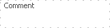

# BUSINESS SOFTWARE MODELS

This chapter will explore some common approaches to model the network of interactions that occur for business processes. These models not only help to provide deeper understanding of the nature of a business process but can facilating the development of systems to collect and analyze the data associated with the process.

## Business Process Model (BPM)

There are many good reasons for using BPMN to model business processes. [@Camunda2018a]


* **Recognized Standard:** BPMN is owned by an institution and is supported by many software products. Third party BPMN editors are available in the form of desktop apps like yEd [@YED2018] or online services like Camunda. [@Camunda2018b]
* **Simplicity:** BPMN is based on a system of graphic symbols that easy to learn.
* **Power of expression:** BPMN reduces descriptions of complex process work flows to a graphic model that is easy to grasp.
* **Implementation in IT:** BPMN was developed to support technical implementation of processes ("Process Automation"). The more important IT becomes in a company, the more helpful BPMN can be, especially when process changes can be accomplished by a simple change of line.


### A simple example

A BPMN model described a process from the beginning (a light or green circle) to the end (a dark red circle). Blocks of tasks leading to key events are specified in sequential order. 


### Notation

Naming conventions help to improve the readability of the process:

* **Tasks:**

   * shown as a rounded rectangle
   * described as a `[verb] + [object]`
   * *Acquire groceries* is better than *first take care of shopping for groceries*

* **Events:** 

  * description of milestones and achievements
  * described as something that has already happened
  * *hunger noticed* is better *when I begin to feel hungry*

### Symbols

BMP Software provide a pallette of objects to describe various aspects of a process.


| Symbol| Description|
|:-----------:|-------------|
|<!-- --> | Start Event: Start of the process chain |
|<!-- --> | End Event: The end of the process chain |
|<!-- --> | Event Message Catch: wait for a message event |
|<!-- --> | Event Message Throw: sending a message event |
|<!-- --> | Task: Work to be done |
|<!-- --> | XOR Gateway: choice of a action stream |
|<!-- --> | Parallel Gateway: initiate simulataneous action stream |
|<!-- --> | Swim lanes: separate the process by roles or actors |


### Sample Business Process Models


\BeginKnitrBlock{rmdexercise}<div class="rmdexercise">
**Correcting a bug in process flow**

Identify and correct the flaw in this process so that
the grass can be weeded, cut and watered in that order but only as required.
</div>\EndKnitrBlock{rmdexercise}


## BPMN Model Simulation

BP Model sumulators allow process designers to test their model. The general approach is to use a task generator that creates and processes tasks at rates equal to the measured performance in the work place. Data is collected to measure the rate of utilization and work flow at all stages of the model in order to identify issues like bottlenecks and irregularities in the work loads of individual employees. Simulation test are usually conducted in 3 phases: 

| Stage | Description | Purpose |
|-------|-------------|---------|
| Modeling | Simple visual model of the business process | Specify the individual roles and the business logic of the process |
| Simulation | Run task generation and execution according to measured performance | Test the model based on work place rates of service |
| Analysis | Creates a dashboard of performance indicators | Verifies process design; Identifies opportunities for process improvement; Helps to maximize employee utilization; Provides for performance-based estimates of cost |

Online services such as http://www.bpsimulator.com provide a useful means for testing a process design through the display of the model, test results dashboard and performance indicators for each stage of the process. The design is actually a translation of a BPMN model into a Event-driven Process Chain (EPC). However, additional key details are required to quantify the capacity and number of resources available. These details are saved in the attributes for each node as shown in the next section. 


### BP Simulator Model Components

The following table is adapted from the online help of BPSimulation. [@BPSSimulator2018]
 

| Object Description	|Example	|
|---------------------|----------------------|
| **Function:** Set of targeted actions to be performed by one or more executors in one role| <!-- --><br>\newline 	 Repair of water supply; Acceptance payment; Sending a message |
| **Execute:**	Position or role of those responsible for the execution of the function	| Motorman; Board member |  <!-- --><br>\newline Name; Number of employees; Cost of using of the resource; Operating periods |
| **Resource:** Service or tools needed to perform the function	| <!-- --><br>\newline Machine; tool; Software | Name; Cost of using of the resource |
| **Tasks Generator:** Generator global tasks of the business process of a certain type with a certain interval for the simulation purposes | <!-- --><br>\newline Client request for a loan; Received customer complaint | Name; Operating periods; Tasks count |
| **Checkpoint:** Auxiliary element for monitoring the process parameters at different stages its execution and control of tasks flow | <!-- --><br>\newline Completing the approval stage; Completion of the process because of inconsistencies detected | Name; Filter tasks; EPC Elements |
| **Event:** Cause or an intangible result of a function |  <!-- --> <br>\newline  Client's visit; An error was detected |
| **Regulate:** Regulate document directly related to the order, conditions or results of the function |  <!-- --><br>\newline  Manuals; Federal Law |
|	**Input:** Material or information necessary to perform the function |  <!-- --> <br>\newline Form; Statement |
| **Output:** Material or information generated or acquired additional properties as a result of the function | <!-- --> <br>\newline  Part; Conclusion |
| **Procedure:**	Set of performance features for a particular purpose | <!-- --> <br>\newline Applications processing; Approval of documentation |
| **Comment:** Auxiliary element model for clarifications or comments| <!-- --> <br>\newline	 Temporary condition; Proposed improvements |

### Linking objects together

All objects in the model should be at least one link to another object. To create a link between objects, you must first double-click on the object - the source of links, and then click on the object - the recipient, link will be created with an arrow on the side of the second object. Link means a direct impact or relationship of one object from another. Not all objects can be linked to each other. The group of objects: Tasks Generator, Function, Events, Procedure and Check Point can be suppliers (predecessors) or consumers (followers) of each other. Other objects only as the impact on function, as shown below the diagram:


With this extra data it is possible to simulate a day at work. The statistics collected help to pinpoint bottlenecks and limiting resources. The system provides a dashboard to summarize the results.


The model uses generators to simulate the volume of the demand for needs. Data comes from the functions and key check points of the model that monitor the workflow that passes these nodes. The executor nodes determine the capacity of the system. Performance is varied by changing the number of individuals in the role of executors. 


### An example: A Petrol Station**

Starting with the BPMN of a simple model of the processes behind getting gas at the petrol station.


 
results in a simulated model within the BPSimulator.


 
The simulation was run in the scenario of only have one cashier, one attendant, one gasohol pump, one diesel pump and 290 customers who arrive. 

| Starting | Ending | Number | Hourly Rate |
|----------|--------|--------|------------|
| 6:00  | 8:59  | 90 | 30 |
| 9:00  | 14:59 | 90 | 15 |
| 15:00 | 18:59 | 90 | 25 |
| 19:00 | 20:00 | 20 | 10 |

As shown in the dashboard, the average queue is 16 min. 
 


\BeginKnitrBlock{rmdexercise}<div class="rmdexercise">
**Exercise: Improving performance of a petrol station**

Using the sample model of a petrol station, determine a proper mix of men and machines that will reduce the queue time to less than 2 mins at the minimum cost.
 </div>\EndKnitrBlock{rmdexercise}

## Enterprise Resource (ERP)

The purpose of Enterprise Resource Planning (ERP) is to harness business data in a way that allows integrated management of core business processes. This business-management software is typically designed as a suite of integrated applications which collect, store, manage, and interpret data from a wide range of business activities. By managing the critical information of all business processes, ERP provides opportunities to support data-driven management decisions is such areas as cash flow,  resources usage, inventory of raw materials, and the status of business commitments such as project milestones, orders fulfilment, purchase order payments, and staff compensation. The system facilitates the sharing of data across divisions of the business, such as manufacturing, purchasing, sales, accounting, and human resources.

### Building Blocks

 

### ProjectFedena.com: an example of an ERP 

Project Fedena was conceived as a project to easily manage all campus records of schools and campuses and was implemented as a ERP system written in Ruby on Rails. The project was originally developed at Foradian Technologies but is now maintained by the open source community.[^Fedena]

[^Fedena]: The Fedena source code can be found online at  https://github.com/projectfedena/fedena


### The MVC Framework

* **Model:** Defines the structure and nature of data used by the system  includes permissions, validation and list of field attributes.
* **View:** Renders outputs according to the limitations of the media such as web, email, sms, mobile, graphic image, json and xml.
* **Controller:** Parses the user request into data queries and passes the response to the appropriate view. User requests are generally variants of the standard types of database functions: create, show, edit, update and delete.
* **Helpers:** calculates basic conversions including support for foreign languages.


The Model implements the ERD. This is example comes from the Subject Model class definition.


```ruby
belongs_to :batch
belongs_to :elective_group
has_many :timetable_entries,:foreign_key=>'subject_id'
has_many :employees_subjects
has_many :employees ,:through => :employees_subjects
has_many :students_subjects
has_many :students, :through => :students_subjects
has_many :grouped_exam_reports
has_and_belongs_to_many_with_deferred_save :fa_groups
validates_presence_of :name, :max_weekly_classes, :code,:batch_id
validates_presence_of :credit_hours,
   :if=>:check_grade_type
validates_numericality_of :max_weekly_classes
validates_numericality_of :amount,:allow_nil => true
validates_uniqueness_of :code, :case_sensitive => false
```

### Unit testing

This is done through a series of Assertions that tried against the functions of a class:


```ruby
class SimpleNumber

   def initialize(num)
       raise unless num.is_a?(Numeric)
       @x = num
   end

   def add(y)
      @x + y
   end

   def multiply(y)
       @x * y
   end
end
```


```ruby
require_relative "simple_number"
require "test/unit"
	 
class TestSimpleNumber < Test::Unit::TestCase
	 
  def test_simple
	assert_equal(4, SimpleNumber.new(2).add(2) )
	assert_equal(6, SimpleNumber.new(2).multiply(3) )
  end	 
end
```

### Available assertions:

| Assertion | Description |
|-----------|-------------|
| `assert( boolean, [message] )`	| True if boolean |
| `assert_equal( expected, actual, [message] )` |	True if expected == actual |
| `assert_not_equal( expected, actual, [message] )` |	True if expected != actual |
| `assert_match( pattern, string, [message] )` |	True if string =~ pattern |
| `assert_no_match( pattern, string, [message] )` |	True if string !~ pattern |
| `assert_nil( object, [message] )` |	True if object == nil |
| `assert_not_nil( object, [message] )` |	True if object != nil |
| `assert_in_delta( expected_float, actual_float, delta, [message] )` |	True if (actual_float - expected_float).abs <= delta |
| `assert_instance_of( class, object, [message] )` |	True if object.class == class |
| `assert_kind_of( class, object, [message] )` |	True if object.kind_of?(class) |
| `assert_same( expected, actual, [message])`  |	True if actual.equal?( expected ).|
| `assert_not_same( expected, actual, [message] )` |	True if not actual.equal?( expected ).|
| `assert_raise( Exception,... ) {block}` |	True if the block raises one of the listed exceptions. |
| `assert_nothing_raised( Exception,...) {block}` |	True if the block does not raise one of the listed exceptions. |
| `assert_throws( expected_symbol, [message] ) {block}` | |
| `assert_nothing_thrown( [message] ) {block}` |	True if the block throws (or doesn't) the expected_symbol. |
| `assert_respond_to( object, method, [message] )` |	True if the object can respond to the given method. |
| `assert_send( send_array, [message] )` |	True if the method sent to the object with the given arguments return true. |
| `assert_operator( object1, operator, object2, [message] )`	| Compares the two objects with the given operator, passes if true |	
	
## Behavior driven Development

Advantages:

* **Single source of truth:** Specifications, tests and documentation are in the same document.
* **Living documentation:** Because they're automatically tested by Cucumber, your specifications are always bang up-to-date.
* **Customer focus:** Cucumber helps business and IT collaborate to build a shared understanding of the business goals

[@Cucumber2019a] supports Behaviour-Driven Development(BDD) by reading executable specifications written in plain text and validating that the software does what those specifications say. The specifications consists of multiple examples, or scenarios written in Gherkin. [@Cucumber2019b]


The primary keywords are:

* `Feature`
* `Example` (`Scenario` and `Scenario Outline` are synonyms)
* Steps: `Given`, `When`, `Then`, `And`, `But`
* `Background`
* `Combinations` (Examples is a synonum)

* `"..."` (Doc Strings)
* `|` (Data Tables)
* `@` (Tags)
* `#` (Comments)

Examples follow this same pattern:

* Describe an initial context (Given steps)
* Describe an event (When steps)
* Describe an expected outcome (Then steps)


### A working example of specs in Cucumber


```ruby
Feature: A simple banking program
        
Background:
   Given a customer named "DrBob"          
   And I have logged in as "DrBob"    

   Scenario: Balance checking   
   Given my account has a balance of $430   
   Then my account should show a balance of $430   
           
   Scenario: Account deposit   
   Given my account has a balance of $400   
   When I deposit $30   
   Then my account should show a balance of $430   
         
   Scenario: Account withdraw   
   Given my account has a balance of $500
   When I withdraw $70
   Then my account should show a balance of $430     
     	 
   Scenario Outline: deposits   
   Given there are <start> dollars in the account   
   When I deposit <added> dollars   
   Then I should have <left> dollars   
     
   Examples:    
     | start | added | left |   
     |    12 |   5   |    7 |   
     |    20 |   5   |   15 |   
```

