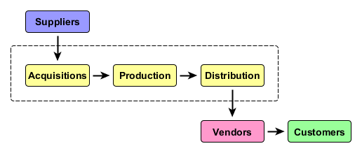
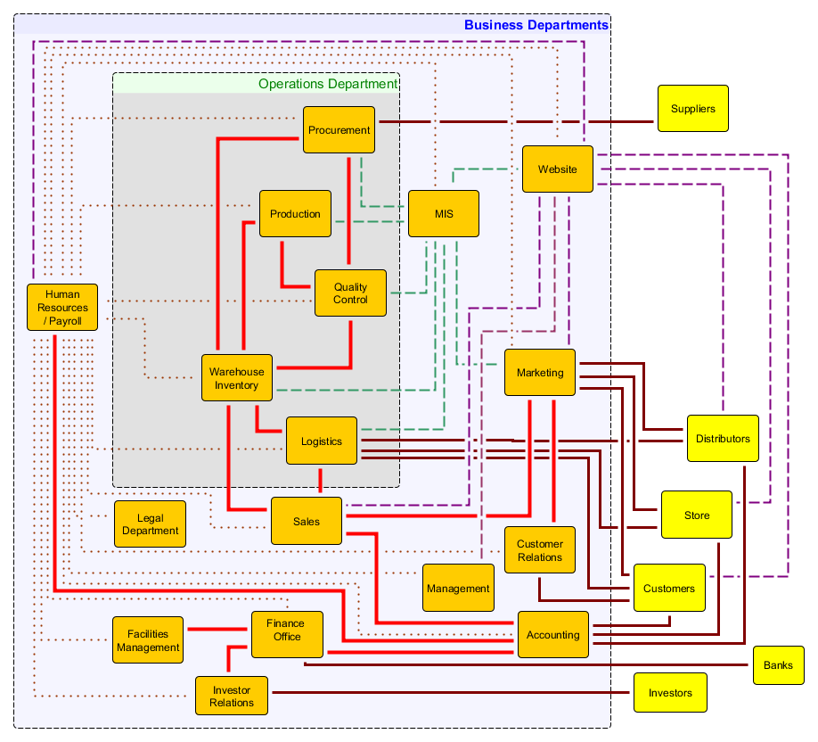
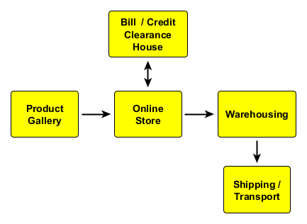

-# GENERAL PRINCIPLES

# Essentials of Business

Business is a network of transactions attempt provide fair compensation for goods or services rendered in the most effective and efficient manner.

> Business is a sustainable set of interactions between individuals in which goods and services are provided and the provider is compensated.

X> ## Nature of Business
X>
X> If businesses were found on the following premises, discuss the expected differences in the nature, success, and longevity of the businesses that would arise based on these principles.
X>
X> 1. Business is all about making lots and lots of money quickly by any means possible.
X> 2. Business is a sustainable series of transaction that provide fair compensation for goods or services rendered in the most effective and efficient manner. 

Individual businesses are always centered around a core set of goods and services as a commodity that creates value. The key to business success is to minimize material, production, and distribution costs while increasing the value of the commodity to the customers. This is achieved through a network of contracts and business transactions with suppliers and distributors.

X> ## Match market principles to market characteristics
X>
X> |  | Principle |   |Characteristics |
X> |---|-----------|---|--------------|
X> | (A) | Access to market |  __ | Consumer preferance |
X> | (B) | Customers        |  __ |Dependable supply of raw materials |
X> | (C) | Investment capital | __ |Distinctive goods and services |
X> | (D) | Marketable goods and services | __ | Investors and line of credit |
X> | (E) | Resources        | __ | Right location |
X> | (F) | Value            | __ | Steady market demand |
X> |---|-----------|---|--------------|

## Core Activities of a Business

To achieve efficiency and effective on a large scale, business is conducted as coordinated teamwork of specialists in various departments within the organizational chart. 
 
* **Finance:** mid-term and long-range financial planning to ensure that there is an adequate supply of money available to 
* **Accounting:** record of financial commitments and compensations for the purpose of tracking movement of value across the organization and throughout the production process
* **Marketing:** getting groups of potential customers and consumers interested in products and services. 
* **Sales:** selling products and services to customers maintain records to assist forecasting future demand and market growth
* **Operations:** systems to acquire resources, produce, package and deliver products
* **Management:** sets the direction and pace of business endeavors

## Support functions:

As businesses grow in size, various support functions are required to keep the core business running at their optimal levels of production. These functions include the following:

* **Management Information Systems:** collect, analyze and distribute mission critical information to key administrators
* **Human Resources:** attract, hire, train and retain effective employees
* **Legal Department:** ensure compliance with laws and regulations
* **Investor Relations:** communications with shareholders to attract support and investments
* **Customer Relations:** after sales care of customers and encouragement of brand loyality
* **Facilities Management:** maintenance of facilities and equipment to maximize the utility and value of capital investments in equipment and infrastructure.

X>## Key concepts:
X>
X> Create a mindmap that illustrate the relationship between the following sets of terms, along with their Thai translations.
X> 
X> * **Key business components:** Access to market; Resources; Value; Investment capital; Marketable goods and services; Customers 
X> * **Core business activities:** Finance; Accounting; Marketing; Sales; Operations; Management.
X> * **Support functions:** Management information systems; Human resources; Legal department; Investor relations; Customer relations; Facilities management

## Software to facilitate business interactions

As the business grows, so does the complexity of the interactions between the departments as shown in the following diagram:

As implied by the multitude of lines, there are numerous interaction within a business organization giving rise to various disciples of study. Management studies focuses on the control, operation and development of a business. Financiers study how to use investments to maximize opportunities to grow the business. But the key concern for IT-related majors is the nature and volume of information to be analyzed, shared and communicated in a timely fashion. 

Even with over 50 years of intensive commercial and propriety software development to reduce the compexity of business, new software tools and apps to support specific business functions are still emerging at an astounding rate. The following sections attempt to classify common software systems found in medium to large size enterprises.

### ERP: Enterprise Resource Planning

* CMS: CONTENT MANAGEMENT SYSTEM

  * Collections of guides, rulebooks, forms and procedure guidelines
  * Blogs, newsletter, announcements
  * Catalogues, pricelists
  
* PIM: PRODUCT INFORMATION MANAGEMENT

  * Manual, troubleshooting guides
  * Parts list, equivalences
  * Price lists and stock inventory
  * Photos and promotional materials
  
* AIS: Accounting Information System

  * Revenue: cash inflow (sales)
  * Expenditure: cash outflow (payroll, equipment)
  * Conversion: work-in-progress transactions (raw material, precursor inventory)
  * Administrative: reporting (income statement, balance sheet, cash flows)
  
### ERM: Enterprise Resource Management

* B2B: Business-to-business software that manages work flow with suppliers and partners

   * Directory of suppliers and products
   * Social media confirmation of quality
   
* B2C: Business-to-consumer software to serve your customers in terms of order status and billing information

   * Online store
   * Product manuals, product information
   * Delivery tracking

* HRM: Human Resources Management 

  * Work experience, Performance appraisal, skill tests
  * Flight risk, employee satisfaction
  * Education, training
  * Payroll, bonuses, raises

* MAP: Marketing Automation Platform

  * CRM: Customer Relationship Management - purchase history, rewards, interests, 
  * MCP: Marketing Campaign Planning - Ad words, analytics, costs, contracts, effectiveness

  
# Essentials of Business Quality Management: (ISO9001)

Business communications are built around active communication chain. Teamwork and management requires effective communication. However, communication breaks down when the communication chain is interupted. 
  
A> ## Communication Chain
A>
A> 
A>
A> | Initiation message | Response message |
A> |-----------|-----------|
A> | Greeting | Acknowledgement |
A> | Question | Response |
A> | Proposal | Acceptance/Rejection |
A> | Command | Action |
A> | Accusation | Acceptance/Rebuttal |

ISO 9000 was first published in 1987 by the International Organization for Standardization (ISO) and was designed as a family of quality management systems standards to help organizations manage the meeting of the needs of customers and while meeting statutory and regulatory requirements related to a product or service.[^iso]  The standards provide guidance and tools for companies and organizations who want to ensure that their products and services consistently meet customer’s requirements, and that quality is consistently improved.

[^iso]: International Organization for Standardization, 2015. ISO 9001:2015(en) Quality management systems. Available online at  https://www.iso.org/obp/ui/#iso:std:iso:9001

* **Point 1: Clear customer understanding** of the goods or services offered
* **Point 2: Verification of intended results** 
* **Point 3: Prevention undesired effects**
* **Point 4: Improve performance** based on the information gathered

A> ## An example of an ISO9001 compliant transaction
A>
A> 1. The customer enters a restuarant and is given a menu with pictures of the food. (P1)
A> 2. The waiter takes the order and repeats the order back to the customer for confirmation. (P1)
A> 3. The waiter brings the food and doubles check that the order is complete. (P2)
A> 4. The waiter comes back to check if everything is okay. (P2)
A> 5. The cashier checks that all was well when the bill is paid. (P3)
A> 6. The whole transaction is recorded and the receipt gives a website for feedback. (P3)
A> 7. The customer's feedback on the website is analyzed for patterns of service that could be improved. (P4)

X> ## ISO9001 and MacDonalds
X>
X> Worldwide MacDonald is a successful multinational enterprize run by staff most of which are under the age of 21 and yet it is a certified ISO9001 company. When a customer orders food at any MacDonald outlet in the world, the interaction between the customer and the counter staff is the same. Create a swim lane workflow diagram to describe the information flow in the conversation between the customer, the counter staff, the kitchen staff, the accounting system and the point of sale computer system. Discuss how this illustrates the basic principles of ISO9001 principles for quality management.

Since ISO 9000 was first published in 1987, it has been follow by a long list of international standards that define and specify how various aspects of business, hardware and software are to be implemented. Each new standard builds on the principles already established in other standards. These developments lead Jim Whitehurst to realize that "the best practices in creating open source software also translate well into managing an entire company." By embracing open source values, he showed how leaders can successfully create "a rebooted, redesigned, reinvented organization suitable for the decentralized, empowered, digital age."[^whitehurst]

[^whitehurst]: Jim Whitehurst, 2015. The Open Organization: Igniting Passion and Performance. Harvard Business Review. Available online at https://opensource.com/open-organization/

As organizations embrace the concept of open organizations they recognize that openness as a necessary orientation toward success and pursing openness in organizations can lead to 3 possessive outcomes:[^ambassador]
 
[^ambassador]: The Open Organization Ambassadors, 2017. The Open Organization Definition. 2nd Edition. Available online at https://opensource.com/sites/default/files/gated-content/openorg_definition_ebook.pdf
 
* **Greater agility:** resulting from the synergy that arises when members share a common vision and work together toward common goals.

* **Faster innovation:** because ideas from both inside and outside the organization receive more equitable consideration and rapid experimentation

* **Increased engagement:** as members clearly see connections between their particular activities and an organization's overarching values, mission, and spirit.

Although every open organization is unique, there is a common core of elements that characterize an open organization. Each core element is composed of a different dataset of information to be gathered and distributed so to allow these elements to be combined in powerful and productive ways.

* **Transparency:** Workers have access to all pertinent information and willingly disclose and discuss their work. People affected by decisions can access and review the processes and arguments that lead to the decision and are free to comment and respond to them. Successes and failures are both valued for the lessons they provide.
* **Inclusivity:** Protocols and procedures are in place to encourage constructive inclusion of diverse perspectives. Leaders are conscious of voices not present in dialog and actively seek to include them. People work transparently and use technical standards to ensure and encourage access to discussion forums.
* **Adaptability:** Feedback mechanisms provide access for suggestions from members of the organizations and outside members.
* **Collaboration:** People ascribe to the principle that working together produces better results from the very beginning of the project. Products of development are made available to other projects to use creatively.
* **Community:** Shared values and principles that guide decision making are clear and obvious to members of the organization. All levels of workers are encouraged and empowered to make meaningful contributions to collaborative work. Leaders mentor others and demonstrate strong accountability to the organizations by modelling shared values and principles.

# Understanding the role of IT in business

## Enterprise Architecture

As IT Departments become more receptive to business strategy and play a transformative role in the nature of the business, Enterprise Architure will emerge along the following evolutionary steps.[^hohpeA][^hohpeB]

[^hohpeA]: Gregor Hohpe, 2017. 37 Things One Architect Knows About IT Transformation: A Chief Architect's Journey. Available online at https://leanpub.com/37things

[^hohpeB]: Gregor Hohpe, 2017. Enterprise Architecture = Architecting the Enterprise? YOW! Conferences and Workshops for Developers by Developers. Keynote presentation at [YOW!2017 Conferences](https://youtu.be/pUYEVJVNSGc) http://yowconference.com.au

A>##Establising an IT department
A>
A>1. Understand the business strategy
A>2. Translate into an IT strategy
A>3. Create transparency
A>4. Define IT target picture
A>5. Define the roadmap
A>6. Harmonize and govern
A>7. Obtain feedback and refine
A>8. Coach and mentor

{title="Approaches to understanding the business", width="80%"}
|Architecting the Business | Reverse-Engineering the Organization |
|:----------------|:-----------|
|* Growth areas |* Divisions / business lines |
|* Profitability |* Group level vs divisions |
|* Geographic/demographic opportunities | * Reportings lines |
|* Geopolitical aspects | * Matrix organizations |
|* Acquisitions and divestitures | * Hidden org chart/loyalities |
|-------|---------|

## Business views of IT

{title="Different business views of IT"}
| | Cost Center | Asset | Partner | Enabler |
|----:|:----:|:----:|:----:|:----:|
| Focus: | Cost | Return on investment | Business value | Speed & Innovation |
|----|----|----|----|----|
|CIO Reports to: | CFO | COO | CDO | CEO |
|----|----|----|----|----|
|Common stragegy: | Outsource IT | Harmonize/Rationalize | Insource IT | IT = business |
|----|----|----|----|----|
|Levers: | Cost cutting | Economies of scale | Economies of Efficiency | Economies of Speed |
|----|----|----|----|----|

IT Strategy provides a road map of where IT developments and operations are going. This is derived from an understanding of the nature of the business and is not restricted by current realities. The IT strategy is as much a definition of what IT intends to do as well as what it will not do. Above all, an effective IT Business strategy does not conform to a vendor's product road map. However, successful strategies must recognize the IT Operating Model that the business gives to IT.[^ross]

[^ross]: Jeanne W. Ross, Peter Weill and David C. Robertson,2006. Enterprize Architecture as Strategy: Creating a foundation for business execution.  Harvard Business Review Press

{title="IT Operating Models", width="100%"}
| Integration | Minimal Standards | Highly Standardized |
|:-----:|:---------------------|:---------------|
|High | **Coordination**       | **Unification** |
|     |* Unique business units | * Single business with global standards |
|     |* Examples: Merrill Lynch, Toyota | * Examples: Delta Airlines, Pepsi |
|     |* Key IT capability:    |* Key IT capability: |
|     |   * access to shared data  |   * enterprise systems to reinforce standards |
|     |   * standard technology interfaces |    * provide access to global data |
|-----|-----------------------|---------------------| 
| Low | **Diversification**   | **Replication** |
|     | * Independent business units | * Independent but similar business units |
|     | * different customers/expertise |  |
|     |* Examples: Johnson & Johnson, GE | Example: Marriott, CEMEX |  
|     |* Key IT capability:    |* Key IT capability: |
|     |    * provide economies of scale |   * provide standard infrastructure and apps |
|     |    * do not limit independence |     * maximize global efficiencies |
|=====|=================================|==============================|

# Changing nature of business

## Emerging role of brick and mortar shops

It is clear that the retail companies in rapid growth are those who are able to upgrade the services of the tranditional storefront into a more convenient, efficient and user-friendly setting that compliments the services available online. Banks have moved their services online and to ATM to increase the convenience of handling money while lowering operating costs. Online companies like Amazon have teamed up with traditional shopping chains like Target to allows customers the opportunity to compare, touch and feel products before purchasing them either in the shop or online. Online orders can be delivered to shops to reduce shipping costs. Amazon has even integrated such high tech features as AI, face recognition and sensor to change the user shopping experience.[^amazon] Technology play a critical role in all of these developments.

[^amazon]: Amazon.com, 2016. Introducing Amazon Go and the world’s most advanced shopping technology. Available online at https://youtu.be/NrmMk1Myrxc

X> ## New generation 7-11 (Seven Eleven)
X>
X> View this news clip about a new Seven Eleven outlet that opened in Pattaya with a new look that is in keeping with the era of Thailand 4.0. The store is full of sensors, monitors and systems to create a modern, futuristic, efficient shopping and eating environment complete with innovations to improve energy-saving and user convenience. Watch the video[^ref711] and list the number of ways computers have been used to change the user experience.

[^ref711]: Thekkit Chat Suriyawong,2018. 7-11 (Seven Eleven) with new generation 4.0 high tech.  Channel 3 News. aired Monday, January 8, 2018 Available online at https://youtu.be/Xl3rEUbpgsE

## Nature of Online Commerce

With the launch of the Internet in the 1990s founded by the development of the world wide web in the 1990s, online commerce has gain advantage over corresponding brick and mortar firms for the following reasons:

1. The customer has access to more information to make better purchasing decisions
2. The customer can shop 24x7
3. The customer can track the progress of order fulfilment.
4. Customers can provide feedback verified through social media.
5. The functions of e-commerce can be purchased and updated to keep development costs low and to maximize economies of scale

### The e-shopping experience

A> ## Customer Experience
A>
A>| Stage | Brick and Mortar | Electronic world |
A>|-------|------------------|------------------|
A>| Customer finds the store. | Ads and billboards | Google and Facebook Ads; Referrals from blogs |
A>|-------|------------------|------------------|
A>|Customer shops for items of interest | Window shopping | Search the website |
A>|-------|------------------|------------------|
A>|Customer searches for information on the products| Check packaging and sales staff | Internet searches and social media recommendations |
A>|-------|------------------|------------------|
A>|Customer chooses items for purchase | Places them in a cart or shopping basket | Virtural transfer of items to an electronic shopping cart |
A>|-------|------------------|------------------|
A>|Customer check outs the selected items for purchase | The customer takes the shopping cart to the check out counter | The virtual cart is checked out creating a preliminary bill complete with shipping information |
A>|-------|------------------|------------------|
A>|The financial institution identifies and authenticates the payer|The customer swipes a credit card or ATM card|The customer logs into to e-banking, e-payment or credit card services|
A>|-------|------------------|------------------|
A>|The customer transfers funds to the vendor.|The customer signs the electronic receipt or pays cash|The customer verifies and authorizes payment|
A>|-------|------------------|------------------|
A>|The financial institution send payment verification.|ATM or Credit card service authenticates the transaction or the cashier |The financial institution sends a secure memo to the e-store that payment was made.|
A>|-------|------------------|------------------|
A>|The vendor sends a pick-list order to the fulfillment center.|The store keeper faxs the order to the warehouse |The fulfilment center is notified of the order and its payment and picks the items|
A>|-------|------------------|------------------|
A>|The fulfillment center sends the goods to shipper.|The items are boxed and set aside for pickup|The items are boxed and sent to the shipper.|
A>|-------|------------------|------------------|
A>|The fulfillment center updates the order status|The customer is called to pick up his order.|The online system is updated and the customer can track its location.|
A>|-------|------------------|------------------|
A>|The shipper delivers the goods.|The counter staff check the delivery items and turns them over to the customer.|The shipper delivers the goods.|
A>|-------|------------------|------------------|
A>|The customer signs for goods and the vendor system is updated.|||
A>|-------|------------------|------------------|

X> ## Hybrid businesses
X>
X> Online shopping giant Amazon has recently merged with Target a traditional department store chain. Explain why this merger is a good idea and what benefits the customer gains from it.

### Approaches to marketing online

1. Search engine ads based on topics being searched
2. Social media ads based on shared views and ideas
3. Personal profiling to drive the user experience at a website based on specific interests and preferences expressed

#### Impact of Social Media on Brand and Product Marketing

1. Word of mouth referrals from trusted acquaintance are powerful endorsements and attractions.
2. Customer testimonials are often decisive in purchasing decisions.
3. Community discussion of a product underdevelopment increases trust 
4. False testimonies are a problem: fakes entries will attempt to over sell a product and grumbling customers will attempt to destroy a company 

