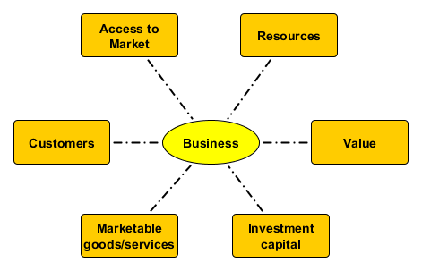

-# GENERAL PRINCIPLES

# Essentials of Business

Business is a network of transactions attempt provide fair compensation for goods or services rendered in the most effective and efficient manner.

> Business is a sustainable set of interactions between individuals in which goods and services are provided and the provider is compensated. 
 
Individual businesses are always centered around a core set of goods and services as a commodity that creates value. The key to business success is to minimize material, production, and distribution costs while increasing the value of the commodity to the customers. This is achieved through a network of contracts and business transactions with suppliers and distributors.

## Core Activities of a Business

To achieve efficiency and effective on a large scale, business is conducted as coordinated teamwork of specialists in various departments within the organizational chart. 
 
* **Finance:** mid-term and long-range financial planning 
* **Accounting:** payment and record of financial commitments and compensations
* **Marketing:** getting groups interested in products and services. 
* **Sales:** selling products and services to customers
* **Operations:** systems to acquire resources, produce and deliver products
* **Management:** sets the direction and pace of the business

## Support functions:

As businesses grow in size, various support functions are required to keep the core business running at their optimal levels of production. These functions include the following:

* **Management Information Systems:** collect, analyze and distribute mission critical information to key administrators
* **Human Resources:** attract, hire, retain and train employees
* **Legal Department:** ensure compliance with laws and regulations
* **Investor Relations:** communications to con shareholders to attract investments
* **Customer Relations:** after sales care of customers
* **Facilities Management:** maintenance of facilities and equipment  

## Interactions within a Business

As the business grows, so does the complexity of the interactions between the departments as shown in the following diagram:

The key concern for IT-related majors is the nature and volumn of information to be analyzed, shared and communicated in a timely fashion. Over the year, a number of software tools have emerged to assist business in this process. The following is a list of the common software systems found in medium to large size enterprises.

* ERP: ENTERPRISE RESOURCE PLANNING
  * CMS: CONTENT MANAGEMENT SYSTEM
  * PIM: PRODUCT INFORMATION MANAGEMENT
  * AIS: Accounting Information System
     * Revenue: cash inflow (sales)
	 * Expenditure: cash outflow (payroll, equipment)
     * Conversion: work-in-progress transactions (raw material, precursor inventory)
	 * Administrative: reporting (income statement, balance sheet, cash flows)
  
* ERM: Enterprise Resource Management
  * B2B: Business-to-business software that manages work flow with suppliers and partners
  * B2C: Business-to-consumer software to serve your customers in terms of order status and billing information
  * HRM: Human Resources Management - an Intranet system that organizes and transmits performance information and tracks of the training, development and productivity of employees
* MAP: MARKETING AUTOMATION PLATFORM
  * CRM: CUSTOMER RELATIONSHIP MANAGEMENT
  * MCP: Marketing Campaign Planning

# Essentials of Business Quality Management: (ISO9001)

ISO 9000 was first published in 1987 by the International Organization for Standardization (ISO) and was designed as a family of quality management systems standards to help organizations manage the meeting of the needs of customers and while meeting statutory and regulatory requirements related to a product or service.[^iso]  The standards provide guidance and tools for companies and organizations who want to ensure that their products and services consistently meet customer’s requirements, and that quality is consistently improved.

[^iso]: International Organization for Standardization, 2015. ISO 9001:2015(en) Quality management systems. Available online at  https://www.iso.org/obp/ui/#iso:std:iso:9001

* **Point 1: Clear customer understanding** of the goods or services offered
* **Point 2: Verification of intended results** 
* **Point 3: Prevention undesired effects**
* **Point 4: Improve performance** based on the information gathered

A> ## An example of an ISO9001 compliant transaction
A>
A> 1. The customer enters a restuarant and is given a menu with pictures of the food. (P1)
A> 2. The waiter takes the order and repeats the order back to the customer for confirmation. (P1)
A> 3. The waiter brings the food and doubles check that the order is complete. (P2)
A> 4. The waiter comes back to check if everything is okay. (P2)
A> 5. The cashier checks that all was well when the bill is paid. (P3)
A> 6. The whole transaction is recorded and the receipt gives a website for feedback. (P3)
A> 7. The customer's feedback on the website is analyzed for patterns of service that could be improved. (P4)

X> ## ISO9001 and MacDonalds
X>
X> Worldwide MacDonald is a successful multinational enterprize run by staff most of which are under the age of 21 and yet it is a certified ISO9001 company. When a customer orders food at any MacDonald outlet in the world, the interaction between the customer and the counter staff is the same. Create a swim lane workflow diagram to describe the information flow in the conversation between the customer, the counter staff, the kitchen staff, the accounting system and the point of sale computer system. Discuss how this illustrates the basic principles of ISO9001 principles for quality management.

# Understanding the role of IT in business

## Enterprise Architecture

As IT Departments become more receptive to business strategy and play a transformative role in the nature of the busines, Enterprise Architure will emerge along the following evolutionary steps.[^hohpeA][^hohpeB]

[^hohpeA]: Gregor Hohpe, 2017. 37 Things One Architect Knows About IT Transformation: A Chief Architect's Journey. Available online at https://leanpub.com/37things

[^hohpeB]: Gregor Hohpe, 2017. Enterprise Architecture = Architecting the Enterprise? YOW! Conferences and Workshops for Developers by Developers. Keynote presentation at [YOW!2017 Conferences](https://youtu.be/pUYEVJVNSGc) http://yowconference.com.au

1. Understand the business strategy
2. Translate into an IT strategy
3. Create transparency
4. Define IT target picture
5. Define the roadmap
6. Harmonize and govern
7. Obtain feedback and refine
8. Coach and mentor

{title="Approaches to understanding the business", width="80%"}
|Architecting the Business | Reverse-Engineering the Organization |
|:----------------|:-----------|
|* Growth areas |* Divisions / business lines |
|* Profitability |* Group level vs divisions |
|* Geographic/demographic opportunities | * Reportings lines |
|* Geopolitical aspects | * Matrix organizations |
|* Acquisitions and divestitures | * Hidden org chart/loyalities |
|-------|---------|

## Business views of IT

{title="Different business views of IT"}
| | Cost Center | Asset | Partner | Enabler |
|----:|:----:|:----:|:----:|:----:|
| Focus: | Cost | Return on investment | Business value | Speed & Innovation |
|CIO Reports to: | CFO | COO | CDO | CEO |
|Common stragegy: | Outsource IT | Harmonize/Rationalize | Insource IT | IT = business |
|Levers: | Cost cutting | Economies of scale | Economies of Efficiency | Economies of Speed |

IT Strategy provides a road map of where IT developments and operations are going. This is derived from an understanding of the nature of the business and is not restricted by current realities. The IT strategy is as much a definition of what IT intends to do as well as what it will not do. Above all, an effective IT Business strategy does not conform to a vendor's product road map. However, successful strategies must recognize the IT Operating Model that the business gives to IT.[^ross]

[^ross]: Jeanne W. Ross, Peter Weill and David C. Robertson,2006. Enterprize Architecture as Strategy: Creating a foundation for business execution.  Harvard Business Review Press

{title="IT Operating Models", width="100%"}
| Integration | Minimal Standards | Highly Standardized |
|:-----:|:---------------------|:---------------|
|High | **Coordination**       | **Unification** |
|     |* Unique business units | * Single business with global standards |
|     |* Examples: Merrill Lynch, Toyota | * Examples: Delta Airlines, Pepsi |
|     |* Key IT capability:    |* Key IT capability: |
|     |   * access to shared data  |   * enterprise systems to reinforce standards |
|     |   * standard technology interfaces |    * provide access to global data |
|-----|-----------------------|---------------------| 
| Low | **Diversification**   | **Replication** |
|     | * Independent business units | * Independent but similar business units |
|     | * different customers/expertise |  |
|     |* Examples: Johnson & Johnson, GE | Example: Marriott, CEMEX |  
|     |* Key IT capability:    |* Key IT capability: |
|     |    * provide economies of scale |   * provide standard infrastructure and apps |
|     |    * do not limit independence |     * maximize global efficiencies |
|=====|=================================|==============================|

# Changing nature of business

## Emerging role of brick and mortar shops

It is clear that the retail companies in rapid growth are those who are able to upgrade the services of the tranditional storefront into a more convenient, efficient and user-friendly setting that compliments the services available online. Banks have moved their services online and to ATM to increase the convenience of handling money while lowering operating costs. Online companies like Amazon have teamed up with traditional shopping chains like Target to allows customers the opportunity to compare, touch and feel products before purchasing them either in the shop or online. Online orders can be delivered to shops to reduce shipping costs. Amazon has even integrated such high tech features as AI, face recognition and sensor to change the user shopping experience.[^amazon] Technology play a critical role in all of these developments.

[^amazon]: Amazon.com, 2016. Introducing Amazon Go and the world’s most advanced shopping technology. Available online at https://youtu.be/NrmMk1Myrxc

X> ## New generation 7-11 (Seven Eleven)
X>
X> View this news clip about a new Seven Eleven outlet that opened in Pattaya with a new look that is in keeping with the era of Thailand 4.0. The store is full of sensors, monitors and systems to create a modern, futuristic, efficient shopping and eating environment complete with innovations to improve energy-saving and user convenience. Watch the video[^ref711] and list the number of ways computers have been used to change the user experience.

[^ref711]: Thekkit Chat Suriyawong,2018. 7-11 (Seven Eleven) with new generation 4.0 high tech.  Channel 3 News. aired Monday, January 8, 2018 Available online at https://youtu.be/Xl3rEUbpgsE

## Nature of Online Commerce

With the launch of the Internet in the 1990s founded by the development of the world wide web in the 1990s, online commerce has gain advantage over corresponding brick and mortar firms for the following reasons:

1. The customer has access to more information to make better purchasing decisions
2. The customer can shop 24x7
3. The customer can track the progress of order fulfilment.
4. Customers can provide feedback verified through social media.
5. The functions of e-commerce can be purchased and updated to keep development costs low and to maximize economies of scale

### The e-shopping experience

1. Customer finds an electronic store.
2. Customer browses the website for items of interest
3. Customer searches for information on the products
4. Customer sends the shopping cart for check out to create an order and provides shipping information
5. The financial institution identifies and authenticates the payer
6. The customer transfers funds to the vendor.
7. The financial institution send payment verification.
8. The vendor sends a pick-list order to the fulfillment center.
9. The fulfillment center sends the goods to shipper.
10. The fulfillment center updates the order status.
11. The shipper delivers the goods.
12. The customer signs for goods and the vendor is updated.

### Approaches to marketing online

1. Search engine ads based on topics being searched
2. Social media ads based on shared views and ideas
3. Personal profiling to determine interests and preferences

#### Impact of Social Media on Brand and Product Marketing

## Business Development and Financing

1. Marketable product or service
2. Right location
3. Dependable supply of raw materials
4. Predictable customers
5. Investors
6. Solid line of credit