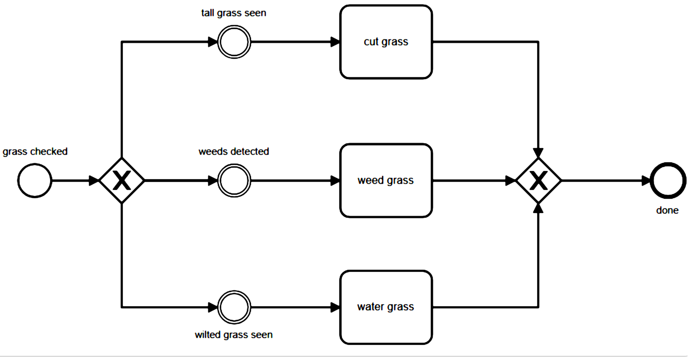
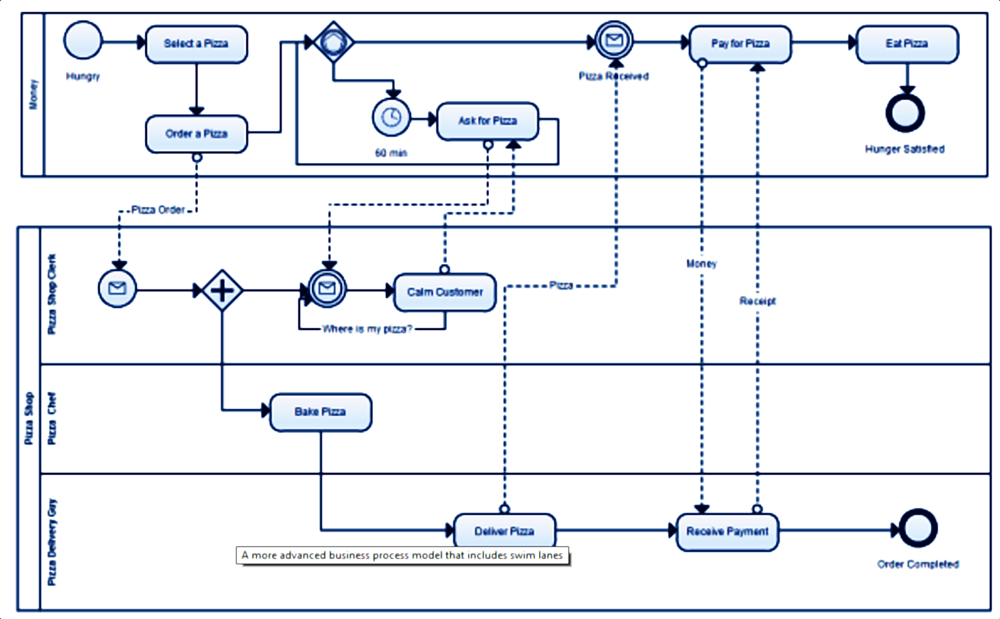
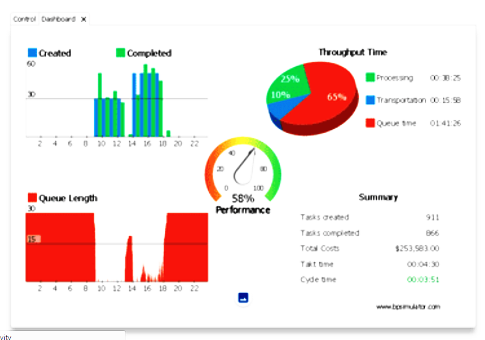

-# BUSINESS SOFTWARE MODELS

# Business Process Model (BPM)

There are many good reasons for using BPMN.[^camunda]

[^camunda]: Camunda, 2018. BPMN Tutorial. Available online at https://camunda.com/bpmn/

* **Recognized Standard:** BPMN is owned by an institution and is supported by many software products. Third party BPMN editors are available in the form of desktop apps like yEd[^yed] or online services like Camunda.[^camunda2]

[^yed]: yWorks, 2018. yEd Graph Editor. Available online at https://www.yworks.com/products/yed?

[^camunda2]: Camunda,2018. BPMN Editor. Available online at https://camunda.com

* **Simplicity:** BPMN is based on a system of graphic symbols that easy to learn.

* **Power of expression:** BPMN reduces descriptions of complex process work flows to a graphic model that is easy to grasp.

* **Implementation in IT:** BPMN was developed to support technical implementation of processes ("Process Automation"). The more important IT becomes in a company, the more helpful BPMN can be, especially when process changes can be accomplished by a simple change of line.

A> ## A simple example
A>
A> The idea of a BPMN model is to model a process from the beginning to the end.

A> 

Naming conventions help to improve the readability of the process:

* **Tasks:** described as a [verb] + [object]: ``Acquire groceries`` is better than *first take care of shopping for groceries*

* **Events:** should be described as something that has already happened ``hunger noticed`` is better *when I begin to feel hungry*

## Notation

| Symbol| Description|
|-------------|-------------|
| | Start Event: Start of the process chain |
| | End Event: The end of the process chain |
| | Event Message Catch: wait for a message event |
| | Event Message Throw: sending a message event |
| | Task: Work to be done |
| | XOR Gateway: choice of a action stream |
| | Parallel Gateway: initiate simulataneous action stream |
| | Swim lanes: separate the process by roles or actors |

### Symbol palettes:

X> ## Correcting a bug in process flow
X>
X> Identify and correct the flaw in this process so that
X> grass can be weeded, cut and watered in that order but only as required.
X>
X> 

## Sample Business Process Models

## BPMN Model Simulation

BP Model sumulators allow process designers to test their model. The general approach is to use a task generator that creates and processes tasks at rates equal to the measured performance in the work place. Data is collected to measure the rate of utilization and work flow at all stages of the model in order to identify issues like bottlenecks and irregularities in the work loads of individual employees. Simulation test are usually conducted in 3 phases: 

| Stage | Description | Purpose |
|-------|-------------|---------|
| Modeling | Simple visual model of the business process | Specify the individual roles and the business logic of the process |
|-------|-------------|---------|
| Simulation | Run task generation and execution according to measured performance | Test the model based on work place rates of service |
|-------|-------------|---------|
| Analysis | Creates a dashboard of performance indicators | Verifies process design; Identifies opportunities for process improvement; Helps to maximize employee utilization; Provides for performance-based estimates of cost |
|-------|-------------|---------|

Online services such as http://www.bpsimulator.com provide a useful means for testing a process design through the display of the model, test results dashboard and performance indicators for each stage of the process. The design is actually a translation of a BPMN model into a Event-driven Process Chain (EPC). However, additional key details are required to quantify the capacity and number of resources available. These details are saved in the attributes for each node as shown in the next section.[ 

### BP Simulator Model Components

 The following table is adapted from the online help of BPSimulation.[^BPS1]
 
[^BPS1]: BPSimulatior.com, 2018. Reference Guide. Available online at https://www.bpsimulator.com/en/help

| Object |Description	|Example	| Properties / Attributes |
|--------|-------------|-----------|-----------|
|Function  |	Set of targeted actions to be performed by one or more executors in one role| Repair of water supply; Acceptance payment; Sending a message | Name; Duration;Rule distribution of tasks from suppliers;Rule distribution of tasks to consumers; Probability distribution of tasks to consumer; Time of delivery a task to consumer; Cost of the resource per task; Local priority; Joint fulfillment |
|--------|-------------|-----------|-----------|
| Execute |	Position or role of those responsible for the execution of the function	| Motorman; Board member | Name; Number of employees; Cost of using of the resource; Operating periods |

|--------|-------------|-----------|-----------|
|Resource  |	Service or tools needed to perform the function	| Machine; tool; Software | Name; Cost of using of the resource |
|--------|-------------|-----------|-----------|
|Tasks Generator |	Generator global tasks of the business process of a certain type with a certain interval for the simulation purposes | Client request for a loan; Received customer complaint | Name; Operating periods; Tasks count |
|--------|-------------|-----------|-----------|
|Checkpoint	|Auxiliary element for monitoring the process parameters at different stages its execution and control of tasks flow | Completing the approval stage; Completion of the process because of inconsistencies detected | Name; Filter tasks; EPC Elements |
|--------|-------------|-----------|-----------|
|Event 		| Cause or an intangible result of a function | Client's visit; An error was detected | Name |
|--------|-------------|-----------|-----------|
|Regulate 	| Regulate document directly related to the order, conditions or results of the function | Manuals; Federal Law | Name |
|--------|-------------|-----------|-----------|
|Input |	Material or information necessary to perform the function | Form; Statement | Name |
|--------|-------------|-----------|-----------|
|Output	| Material or information generated or acquired additional properties as a result of the function | Part; Conclusion | Name |
|--------|-------------|-----------|-----------|
|Procedure  |	Set of performance features for a particular purpose | Applications processing; Approval of documentation | Name |
|--------|-------------|-----------|-----------|
|Comment |	Auxiliary element model for clarifications or comments| Temporary condition; Proposed improvements | Name |
|--------|-------------|-----------|-----------|

### Properties

 The following table is adapted from the online help of BPSimulation.[^BPS] It explains the nature of each attribute mentioned above.
 
[^BPS]: BPSimulator.com, 2018. Reference Guide. Available online at https://www.bpsimulator.com/en/help

| Property |	Type	|Description |
|---------|------------------|-----------------------|
| Name | Text | Text description of the object. Example of function name: "Payroll preparation"|
|---------|------------------|-----------------------|
|Duration | Number | The minimum and maximum duration of the function. For example, the duration of the function "Processing of details" is from 20 to 30 minutes.|
|---------|------------------|-----------------------|
|Rule distribution of tasks from suppliers | AND/XOR | Logical rule for processing of tasks, received from its predecessors function. If the value is XOR function will be assigned to the execution of tasks on delivery from any predecessor on model. If the value is AND function will not be executed until by a links of all predecessors functions do not will come the same task. Example:  |
|---------|------------------|-----------------------|
|Rule distribution of tasks to consumer | AND/XOR | Logical rule for distribution of completed tasks to consumers of the function. If the value is AND a completed tasks will be distributed to all customer's functions. If the value is XOR task will be distributed to the consumer with a certain Probability distribution of tasks to consumer. Example: |
|---------|------------------|-----------------------|
|Probability distribution of tasks to consumer | Number | Percentage that determines the probability distribution of tasks to a consumer of the function. The sum of all percent probability distribution of the output of one function must be equal to 100% with value of Rule distribution of tasks to consumer is XOR.|
|---------|------------------|-----------------------|
|Time of delivery a task to consumer | Range | Minimum and maximum value of the time required for transporting completed tasks to the next consumer of the function. For example transfer time from the back-office signed copies of the contract to the customer is from 12 to 24 hours.|
|---------|------------------|-----------------------|
|Cost of the resource per task | Currency unit | In case of set up determines the costs of resource use to perform a single task, regardless of the time spent. For example the delivery of goods by courier to the city costs 200 currency unit.|
|---------|------------------|-----------------------|
|Number of employees | Number | The actual number of staff positions in the organizational structure or appointed as an executive of the functions. For example, 5 employees of call center to answer the incoming calls.|
|---------|------------------|-----------------------|
|Cost of using of the resource | Currency unit | Pay rate hours of operation of the resource. For example, the make-up artist working hour is worth 1000, and lease of cloud storage just 0.0001 of currency unit.|
|---------|------------------|-----------------------|
|Operating periods | Range | The time period available resources to perform the functions. For example, to account for the availability of dinner break necessary two periods: 09:00-13:00 and 14:00-18:00.|
|---------|------------------|-----------------------|
|Tasks count | Number | The number of tasks formed by the generator at a certain period of work. For example, to simulate the arrival rate of new tasks 1 times per minute necessary to set the frequency to 60 tasks per hour.|
|---------|------------------|-----------------------|
|Global priority | Number | Priority of task assignment subject to availability of queued for processing multiple tasks of different types. Such as priority of tasks for debt collection of customers, who the first time overdue.|
|---------|------------------|-----------------------|
|Local priority | Number | Priority of task assignment subject to availability of queued for processing multiple tasks from different previous functions. For example priority for tasks returned for revision.|
|---------|------------------|-----------------------|
|Joint fulfillment | Boolean | To perform a function necessary to assign one by one employee from available resources. For example for piano four hands require two pianist (left and right) together.|
|---------|------------------|-----------------------|
|Filter tasks | List | The list of Tasks Generators tasks of which will be transported to the next object of flow. An empty list allows passing any tasks.|
|---------|------------------|-----------------------|

### Linking objects together

All objects in the model should be at least one link to another object. To create a link between objects, you must first double-click on the object - the source of links, and then click on the object - the recipient, link will be created with an arrow on the side of the second object. Link means a direct impact or relationship of one object from another. Not all objects can be linked to each other. The group of objects: Tasks Generator, Function, Events, Procedure and Check Point can be suppliers (predecessors) or consumers (followers) of each other. Other objects only as the impact on function, as shown below the diagram:

* An "X" and "+" at the beginning or end of the link means allocation rules "XOR" or "AND" accordingly. The numbers at the beginning of the arrows correspond to the value of the Probability distribution of tasks to consumer.
 
* All manipulations with the objects of the model are reversible and can be reversed by a visual component at the bottom of the screen or pressing Ctrl+Z on the keyboard.

A> ### Keyboard shortcuts
A>
A> | Keystroke | Description of function |
A> |-----------|-------------------------|
A> |Ctrl+C | copy of selected objects to the clipboard|
A> |Ctrl+S | save the model|
A> |Ctrl+V | paste of copied objects|
A> |Ctrl+Z | undo the last action on the object of model|
A> |Ctrl+Shift+Z | redo the last action on the object of model|
A> |Delete, Backspace | remove of selected objects|
A> |-----------|-------------------------|

With this extra data it is possible to simulate a day at work. The statistics collected help to pinpoint bottlenecks and limiting resources. The system provides a dashboard to summarize the results.
 

The model uses generators to simulate the volume of the demand for needs. Data comes from the functions and key check points of the model that monitor the workflow that passes these nodes. The executor nodes determine the capacity of the system. Performance is varied by changing the number of individuals in the role of executors. 

X> ### The Petrol Station
X>
X> Starting with the BPMN of a simple model of the processes behind getting gas at the petrol station.
X>
X> 
X> 
X> results in a simulated model within the BPSimulator.
X>
X> 
X> 
X> The simulation was run in the scenario of only have one cashier, one attendant, one gasohol pump, one diesel pump and 290 customers who arrive. 
X>
X> | Starting | Ending | Number | Hourly Rate |
X> |----------|--------|--------|------------|
X> | 6:00  | 8:59  | 90 | 30 |
X> | 9:00  | 14:59 | 90 | 15 |
X> | 15:00 | 18:59 | 90 | 25 |
X> | 19:00 | 20:00 | 20 | 10 |
X>
X> As shown in the dashboard, the average queue is 16 min. 
X> 
X> 
X>
X> Using this model, determine a proper mix of men and machines that will reduce the queue time to less than 2 mins at the minimum cost.
 
# Enterprise Resource (ERP)

The purpose of Enterprise Resource Planning (ERP) is to harness business data in a way that allows integrated management of core business processes. This business-management software is typically designed as a suite of integrated applications which collect, store, manage, and interpret data from a wide range of business activities. By managing the critical information of all business processes, ERP provides opportunities to support data-driven management decisions is such areas as cash flow,  resources usage, inventory of raw materials, and the status of business commitments such as project milestones, orders fulfilment, purchase order payments, and staff compensation. The system facilitates the sharing of data across divisions of the business, such as manufacturing, purchasing, sales, accounting, and human resources.

## Building Blocks

 

### ProjectFedena.com: an example of an ERP 

Project Fedena was conceived as a project to easily manage all campus records of schools and campuses and was implemented as a ERP system written in Ruby on Rails. The project was originally developed at Foradian Technologies but is now maintained by the open source community. The source code can be found online at  https://github.com/projectfedena/fedena

## The MVC Framework

* **Model:** Defines the structure and nature of data used by the system  includes permissions, validation and list of field attributes.
* **View:** Renders outputs according to the limitations of the media such as web, email, sms, mobile, graphic image, json and xml.
* **Controller:** Parses the user request into data queries and passes the response to the appropriate view. User requests are generally variants of the standard types of database functions: create, show, edit, update and delete.
* **Helpers:** calculates basic conversions including support for foreign languages.

The Model implements the ERD. This is example comes from the Subject Model class definition.

     belongs_to :batch
     belongs_to :elective_group
     has_many :timetable_entries,:foreign_key=>'subject_id'
     has_many :employees_subjects
     has_many :employees ,:through => :employees_subjects
     has_many :students_subjects
     has_many :students, :through => :students_subjects
     has_many :grouped_exam_reports
     has_and_belongs_to_many_with_deferred_save :fa_groups
     validates_presence_of :name, :max_weekly_classes, :code,:batch_id
     validates_presence_of :credit_hours, :if=>:check_grade_type
     validates_numericality_of :max_weekly_classes
     validates_numericality_of :amount,:allow_nil => true
     validates_uniqueness_of :code, :case_sensitive => false

## Testing

### Unit test

This is done through a series of Assertions that tried against the functions of a class:

	class SimpleNumber

	  def initialize(num)
		raise unless num.is_a?(Numeric)
		@x = num
	  end

	  def add(y)
		@x + y
	  end

	  def multiply(y)
		@x * y
	  end

	end

	require_relative "simple_number"
	require "test/unit"
	 
	class TestSimpleNumber < Test::Unit::TestCase
	 
	  def test_simple
		assert_equal(4, SimpleNumber.new(2).add(2) )
		assert_equal(6, SimpleNumber.new(2).multiply(3) )
	  end	 
	end

Available assertions:

| Assertion | Description |
|-----------|-------------|
| assert( boolean, [message] )	| True if boolean |
| assert_equal( expected, actual, [message] ) |	True if expected == actual |
| assert_not_equal( expected, actual, [message] ) |	True if expected != actual |
| assert_match( pattern, string, [message] ) |	True if string =~ pattern |
| assert_no_match( pattern, string, [message] ) |	True if string !~ pattern |
| assert_nil( object, [message] ) |	True if object == nil |
| assert_not_nil( object, [message] ) |	True if object != nil |
| assert_in_delta( expected_float, actual_float, delta, [message] ) |	True if (actual_float - expected_float).abs <= delta |
| assert_instance_of( class, object, [message] ) |	True if object.class == class |
| assert_kind_of( class, object, [message] ) |	True if object.kind_of?(class) |
| assert_same( expected, actual, [message])  |	True if actual.equal?( expected ).|
| assert_not_same( expected, actual, [message] ) |	True if not actual.equal?( expected ).|
| assert_raise( Exception,... ) {block}|	True if the block raises one of the listed exceptions. |
| assert_nothing_raised( Exception,...) {block} |	True if the block does not raise one of the listed exceptions. |
| assert_throws( expected_symbol, [message] ) {block} |
| assert_nothing_thrown( [message] ) {block} |	True if the block throws (or doesn't) the expected_symbol. |
| assert_respond_to( object, method, [message] ) |	True if the object can respond to the given method. |
| assert_send( send_array, [message] ) |	True if the method sent to the object with the given arguments return true. |
| assert_operator( object1, operator, object2, [message] )	| Compares the two objects with the given operator, passes if true |	
	
### Behavior driven Development

Advantages:

* **Single source of truth:** Specifications, tests and documentation are in the same document.
* **Living documentation:** Because they're automatically tested by Cucumber, your specifications are always bang up-to-date.
* **Customer focus:** Cucumber helps business and IT collaborate to build a shared understanding of the business goals

Cucumber supports Behaviour-Driven Development(BDD) by reading executable specifications written in plain text and validating that the software does what those specifications say. The specifications consists of multiple examples, or scenarios were in Gherkin. https://docs.cucumber.io/gherkin/reference/

The primary keywords are:

* Feature
* Example (Scenario and Scenario Outline are synonyms)
* Steps: Given, When, Then, And, But
* Background
* Combinations (Examples is a synonum)

* """ (Doc Strings)
* | (Data Tables)
* @ (Tags)
* # (Comments)

Examples follow this same pattern:

* Describe an initial context (Given steps)
* Describe an event (When steps)
* Describe an expected outcome (Then steps)

Here is a simple application to illustrate this

     Feature: A simple banking program
     
        
     Background:
       Given a customer named "DrBob"          
       And I have logged in as "DrBob"    

        
     Scenario: Balance checking   
       Given my account has a balance of $430   
       Then my account should show a balance of $430   
     
           
     Scenario: Account deposit   
       Given my account has a balance of $400   
       When I deposit $30   
       Then my account should show a balance of $430   
     
         
     Scenario: Account withdraw   
       Given my account has a balance of $500
       When I withdraw $70
       Then my account should show a balance of $430     
     
     	 
     Scenario Outline: deposits   
       Given there are <start> dollars in the account   
       When I deposit <added> dollars   
       Then I should have <left> dollars   
     
     
     Examples:    
       | start | added | left |   
       |    12 |   5   |    7 |   
       |    20 |   5   |   15 |   

This is actually a working example.
