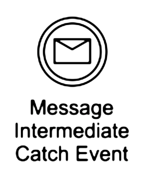

# BUSINESS SOFTWARE MODELS

## Business Process Model (BPM)

There are many good reasons for using BPMN.[Camunda 2018a]{#Camunda2018a}

* **Recognized Standard:** BPMN is owned by an institution and is supported by many software products. Third party BPMN editors are available in the form of desktop apps like yEd[yWorks 2018]{#YED2018} or online services like Camunda.[Camunda2018b]{#Camunda2018b}

* **Simplicity:** BPMN is based on a system of graphic symbols that easy to learn.

* **Power of expression:** BPMN reduces descriptions of complex process work flows to a graphic model that is easy to grasp.

* **Implementation in IT:** BPMN was developed to support technical implementation of processes ("Process Automation"). The more important IT becomes in a company, the more helpful BPMN can be, especially when process changes can be accomplished by a simple change of line.

A> ### A simple example
A>
A> The idea of a BPMN model is to model a process from the beginning to the end.

A> 

Naming conventions help to improve the readability of the process:

* **Tasks:** described as a [verb] + [object]: *Acquire groceries* is better than *first take care of shopping for groceries*

* **Events:** should be described as something that has already happened *hunger noticed* is better *when I begin to feel hungry*

## Notation

| Symbol| Description|
|-------------|-------------|
| | Start Event: Start of the process chain |
| | End Event: The end of the process chain |
| | Event Message Catch: wait for a message event |
| | Event Message Throw: sending a message event |
| | Task: Work to be done |
| | XOR Gateway: choice of a action stream |
| Parallel Gateway | Parallel Gateway: initiate simulataneous action stream |
| Parallel Swimlanes | Swim lanes: separate the process by roles or actors |

