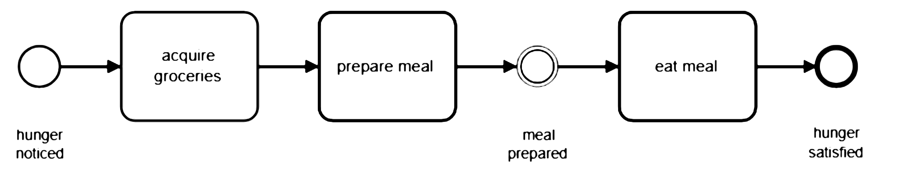
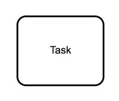

-# BUSINESS SOFTWARE MODELS

# Business Process Model (BPM)

There are many good reasons for using BPMN.[^camunda]

[^camunda]: Camunda, 2018. BPMN Tutorial. Available online at https://camunda.com/bpmn/

* **Recognized Standard:** BPMN is owned by an institution and is supported by many software products. Third party BPMN editors are available in the form of desktop apps like yEd[^yed] or online services like Camunda.[^camunda2]

[^yed]: yWorks, 2018. yEd Graph Editor. Available online at https://www.yworks.com/products/yed?

[^camunda2]: Camunda,2018. BPMN Editor. Available online at https://camunda.com

* **Simplicity:** BPMN is based on a system of graphic symbols that easy to learn.

* **Power of expression:** BPMN reduces descriptions of complex process work flows to a graphic model that is easy to grasp.

* **Implementation in IT:** BPMN was developed to support technical implementation of processes ("Process Automation"). The more important IT becomes in a company, the more helpful BPMN can be, especially when process changes can be accomplished by a simple change of line.

A> ## A simple example
A>
A> The idea of a BPMN model is to model a process from the beginning to the end.

A> 

Naming conventions help to improve the readability of the process:

* **Tasks:** described as a [verb] + [object]: ``Acquire groceries`` is better than *first take care of shopping for groceries*

* **Events:** should be described as something that has already happened ``hunger noticed`` is better *when I begin to feel hungry*

## Notation

| Symbol| Description|
|-------------|-------------|
| | Start Event: Start of the process chain |
| | End Event: The end of the process chain |
| | Event Message Catch: wait for a message event |
| | Event Message Throw: sending a message event |
| | Task: Work to be done |
| | XOR Gateway: choice of a action stream |
| | Parallel Gateway: initiate simulataneous action stream |
| | Swim lanes: separate the process by roles or actors |

### Symbol palettes:

X> ## Correcting a bug in process flow
X>
X> Identify and correct the flaw in this process so that
X> grass can be weeded, cut and watered in that order but only as required.
X>
X> 

## Sample Business Process Models

## BPMN Model Simulation

BP Model sumulators allow process designers to test their model. The general approach is to use a task generator that creates and processes tasks at rates equal to the measured performance in the work place. Data is collected to measure the rate of utilization and work flow at all stages of the model in order to identify issues like bottlenecks and irregularities in the work loads of individual employees. Simulation test are usually conducted in 3 phases: 

| Stage | Description | Purpose |
|-------|-------------|---------|
| Modeling | Simple visual model of the business process | Specify the individual roles and the business logic of the process |
|-------|-------------|---------|
| Simulation | Run task generation and execution according to measured performance | Test the model based on work place rates of service |
|-------|-------------|---------|
| Analysis | Creates a dashboard of performance indicators | Verifies process design; Identifies opportunities for process improvement; Helps to maximize employee utilization; Provides for performance-based estimates of cost |
|-------|-------------|---------|

Online services such as http://www.bpsimulator.com provide a useful means for testing a process design through the display of the model, test results dashboard and performance indicators for each stage of the process.

# Enterprise Resource (ERP)
## Building Blocks
## Sample ERP Systems
