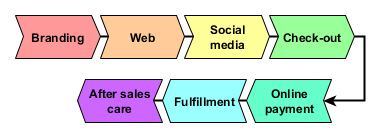

-# BUSINESS SOFTWARE SYSTEMS

# Online Store 

## Stages in Customer Purchasing Decisions

## Business Processe to Support Shoppers 

## Steps of check out and order fulfillment

* Login: links to shopping cart and history
  * Establish an account with the vendor
  * Add items to the shopping cart

* Shopping cart check out
  * Conducts an inventory check of items in shopping cart
  * Determines the mode of shipping
  * Calculates bill

* Renumeration via bank transfer
  * Determines the method of payment
  * Login onto financial service
  * Confirms the transaction
  * SMS validation code to telephone
  * Conducts and records the transaction
  * Send payment confirmation to the vendor

* Send a shipping request to the Fulfillment Center
  * Pick list and shipping manifest
  * Print shipping label
  * Send pick up order to delivery service

* Shipping 
  * Record shipment pickup
  * Register the shipment
  * Track the shipment
  * Record the delivery
  
# Customer Relations Management

## Post sales service

* Unpacking instructions
* Installation instructions
* User instructions
* Troubleshooting guide
* Technical support hotline
* Service center locations

# Human Resources Management

## Assessing Personal Temperment

Every person is unique and represents a unique set of strengths and weaknesses. At the same time the every job requires different set of characteristics. The role of HR is to attempt to collectin information meant to measure and ascertain how suited  an applicant is for a job opening. In theory the goal is to play the right person in the job. However as implied by the following word cloud, fitness of applicants for a job has many dimensions and is hard to measure accurately.

X> ## Employee selection criteria
x>
X> For each of the following job descriptions what would be the top 4 characteristics would you choose to identify a suitable candidate:
X> 
X> 1. **Software Developer:** At XXX, we pursue greatness for our clients while reaching our own potential as well. To achieve this, we are building a team of people who can work independently, who push themselves to find creative solutions, who collaborate naturally, and who, above all, value doing good work. We are looking for new members for our team who can craft web and mobile applications that fit inside a larger communications, business, and product strategies. We focus on the problems to be solved instead of lists of functional requirements. The applications we develop are always part of larger strategy and help us foster close partnerships with our clients and the users of our applications. Together we work to amplify the effectiveness of our clients and accelerate their growth.
X> 2. **Data scientist:** At YYY, we work closely with business users to identify business problems and develop solutions using data science techniques. To this end, we design and implement data models to explain and solve critical problems using such techniques as data mining, statistical modeling, and machine learning. We are looking for a worker who can provide insightful visualization and explanation of trends in client data and recommend the next course of action to be taken by decision makers and their colleagues.
X> 3. **Robotics Engineer:** We are seeking a Robotic Engineer with technical leadership expertise to optimize the expansion of our paint robot program by improving the efficiency, productivity and quality of our program. You will be responsible for program operation, fault recovery procedures, troubleshooting and all around leadership of a state-of-the-art program to triple the paint volume of our previous model. In addition, you will contribute to improvements in Robot Safety, graphic user interface, electrostatic paint application, robot pathing, robotic fluid delivery systems, and the training of the next generation of program operators.
X> 4. **Solutions Architect:** At WWW, we are looking for someone with a passion to help customers design large distributed systems using the world’s most advanced cloud computing technologies. This job requires someone who can communicate, consult, and provide leadership while helping to guide major projects to success. We are hiring a Solutions Architect who can think strategically about business, product, and technical challenges and who will own technical engagement with customers on projects, working cross-organizationally to facilitate adoption and use of the cloud platform. At the same time, the job will involve developing a deep expertise in the cloud technologies and contributing to the know-how in the construction of applications and services on the cloud platform.
   

## Belbin Team Roles

Research showed that the most successful teams were made up of a diverse mix of behaviours; they had access to all nine Belbin Team Roles. A Team Role was defined by Dr Meredith Belbin as "A tendency to behave, contribute and interrelate with others in a particular way". The value of Belbin Team Role theory lies in enabling an individual or team to benefit from self knowledge and adjust according to the demands being made by the external situation.

The concept was derived from a study of successful and unsuccessful teams competing in
Business Games at Henley Management College, England. Managers taking part in the exercise
were given a battery of psychometric tests and put into teams of varying composition. As time
progressed different clusters of behaviour were identified as underlying the success of the teams. These successful clusters of behaviour were then given names. Hence the emergence of nine Team Roles shown with the distribution among British managers:[^fisher]

[^fisher]: S.G. Fisher, TA Hunter and WDK Macross, 1998. The distribution of Belbin team roles among UK managers. Personnel Review, Vol. 29 Iss 2 pp. 124 - 140
 

| Roles | | Belbin Types | |
|:------------------|:---------------:|:------:|:------:|
|Action-oriented: | Shaper | Implementer  | Completer Finisher|
| | 2.3% | 11.4% | 3.6% |
|------|-------|-------|-------|
|People-oriented: | Co-ordinator | Teamworker | Resource Investigator|
|  | 26.2% | 18.2% | 33.2% |
|------|-------|-------|-------|
|Thinking-oriented: | Plant |Monitor  Evaluator | Specialist |
|   |  3.7% |  0.5% | 0.8% |
|=====|======|========|========|

This doesn't mean that every team requires nine people! Most people will have two or three Team Roles that they are most comfortable with. Team Roles develop and mature. These may change with experience and conscious attention. Different Team Roles may come to the fore in response to the needs of particular situations.

| Role Description | Strengths |  Allowable weaknesses | Concerns |
|:---------------|:------------------|:--------------|:----------------|
| **Resource Investigator:**  Uses their inquisitive nature to find ideas to bring back to the team. | Outgoing, enthusiastic. Explores opportunities and develops contacts. | Might be over-optimistic, and can lose interest once the initial enthusiasm has passed.| They might forget to follow up on a lead. | 
|---------------|------------------|--------------|----------------|
| **Teamworker:** Helps the team to gel, using their  versatility to identify the work required and complete it on behalf of the team.| Co-operative, perceptive and diplomatic. Listens and averts friction. | Can be indecisive in crunch situations and tends to avoid  confrontation.| They might hesitate to make unpopular decisions. |
|---------------|------------------|--------------|----------------| 
| **Co-ordinator:** Needed to focus on the team's objectives, draw out team members and delegate work appropriately.| Mature, confident, identifies talent. Clarifies goals. | Can be seen as manipulative and might offload their own share of the work. |  They can over-delegate, leaving themselves little work to do. |
|---------------|------------------|--------------|----------------|
| **Plant:** Tends to be highly creative and good at solving problems in unconventional ways. | Creative, imaginative, free-thinking, generates  ideas and solves difficult problems. | Might ignore incidentals, and may be too preoccupied to communicate effectively. | They could be absent-minded and forgetful. |
|---------------|------------------|--------------|----------------| 
| **Monitor Evaluator:** Provides a logical eye, making impartial judgements where required  and weighs up the team's options   | Sober, strategic and discerning. Sees all options and judges accurately. | Sometimes lacks the drive in a dispassionate way. and ability to inspire others and can be  overly critical.| They could be slow to come to decisions. |
|---------------|------------------|--------------|----------------| 
| **Specialist:** Brings in-depth knowledge of a key area to the team. | Single-minded, self-starting  and dedicated. They provide specialist knowledge and skills.| Tends to contribute on a narrow front and can dwell on the technicalities.| They can overload colleagues with  technical information. |
|---------------|------------------|--------------|----------------| 
| **Shaper:** Provides the necessary drive  to ensure that the team keeps moving and does not lose focus or momentum.| Challenging, dynamic, thrives on pressure. Has the drive and courage to overcome  obstacles.| Can be prone to  provocation, and may sometimes offend people's feelings.|  They could risk becoming aggressive and bad-humoured in their attempts to get things done. |
|---------------|------------------|--------------|----------------|
| **Implementer:** Needed to plan a workable strategy and carry it out as efficiently as possible.| Practical, reliable, efficient. Turns ideas into actions and organises work that needs to be done.| Can be a bit inflexible and slow to respond to new possibilities.| They might be slow to relinquish their plans in favour of positive changes.|
|---------------|------------------|--------------|----------------|
| **Completer Finisher:** Most effectively used at the end of tasks to polish and scrutinise the work for errors, subjecting it to the highest standards of quality control.| Painstaking, conscientious, anxious. Searches out errors. Polishes and perfects. |  Can be inclined to worry unduly, and reluctant to delegate. | They could be  accused of taking their   perfectionism to extremes. |
|---------------|------------------|--------------|----------------|

## Big 5 Behavioral Types

| Behavioral Characteristic | Low end | High end |
|----------------------|--------------|----------|
| **Openness to experience:** Appreciation for art, emotion, adventure, unusual ideas curiosity, variety of experience and intellectual curiosity, creativity and a preference for novelty and variety.| consistent, cautious (Accountants) | inventive, curious(Artists) |
|---------------------------|-----------|-------------|
| **Conscientiousness:** A tendency to be organized and dependable, show self-discipline, act dutifully, aim for achievement, and prefer planned rather than spontaneous behavior.  |  easy-going, careless, sloppy. (Graffiti artist)| efficient, organized, stubborn. (Engraver) |
|-------------------------|-----------|-------------|
| **Extraversion:** Energy, positive emotions, surgency, assertiveness, sociability and the tendency to seek stimulation in the company of others, talkativeness and is often perceived as attention-seeking and domineering. | solitary, reserved, shy, introvert. (Hermit) | outgoing, energetic, boisterous, extravert. (Cheerleader) |
|-------------------------|-----------|-------------|
| **Agreeableness:** A tendency to be compassionate and cooperative rather than suspicious and antagonistic towards others. It related to a trusting and helpful nature. | challenging, detached, rigid. (Prosecutor)  | friendly, compassionate, helpful. (Social worker) |
|-------------------------|-----------|-------------|
| **Neuroticism:** Neuroticism identifies certain people who are more prone to psychological stress and a tendency to experience unpleasant emotions easily.| confident|secure, cool (Air traffic controller) |sensitive, nervous, explosive. (Drug addict)|
|-------------------------|-----------|-------------|

## Myers Briggs Test

The 16 personality types that were developed by Isabel Briggs Myers and Katharine Cook Briggs, which was built on the work of Carl Jung in the early 1900s. Based on the 4 dimensions of Carl Jung's theory of personality types:

| Dimension | Extremes |
|:-------------|:------------|
|Energizes | Extroversion (E) vs Internal (I)|
|Perceives information | Sensing (S) vs Intuitive (N)|
|Decision making| Thinking (T) vs Feeling (F)|
|World view | Judging (J) vs Perceiving (P)|
 
Myers Briggs Test has been administered to a large number of people helping to validate the value of this instrument for a number of applications. Generally successful workers tend to gravitate to specific careers based on their personality profile as shown in the next sections.[^tieger]

[^tieger]: Paul D. Tieger, Barbara Barron, Kelly Tieger, 2014.  Do What You Are: Discover the Perfect Career for You Through the Scecrets of Personality Type. Little, Brown and Company, 5th edition.
 
 
### Analysts:

* **INTJ** (2.1%) -  The Mastermind/The Scientist – Independent, original, analytical, and determined with an exceptional ability to turn theories into solid plans of action. Creative perfectionists who prefer to do things their own way, INTJs perform well in non-social roles that require them to think theoretically. Common careers: Investment banker, Personal financial advisor, Software developer, Economist, Executive

* **INTP** (3.3%) - The Thinker – Logical, original, creative thinkers. Can become very excited about theories and ideas. Independent and creative problem-solvers, INTPs gravitate toward roles that require them to be theoretical and precise. Common careers - Computer programmer, software designer, Financial analyst, Architect, College professor, Economist

* **ENTJ** (1.8%) - The Commander – Assertive and outspoken - they are driven to lead. Excellent ability to understand difficult organizational problems and create solid solutions. Natural leaders who are logical, analytical, and good strategic planners, ENTJs gravitate toward authoritarian roles that require them to be organized and efficient. Common careers: Executive, Lawyer, Market research analyst, Management consultant, Venture capitalist

* **ENTP** (3.2%) - The Debater – Creative, resourceful, and intellectually quick. Good at a broad range of things. Enterprising creative people who enjoy new challenges, ENTPs excel in risky roles that require them to be persistent and non-conformist.  Common careers: Entrepreneur, Real estate developer, Advertising creative director, Marketing director, Politician/political consultant

### Diplomats:

* **INFJ** (1.5%) - The Counselor/The Protector – Quietly forceful, original, and sensitive. Tend to stick to things until they are done. Thoughtful, creative people driven by firm principles and personal integrity, INFJs do well in behind-the-scenes roles that require them to communicate on a personal level. Common careers: Therapist/counsellor, Social worker, HR diversity manager, Organization development consultant, Customer relations manager

* **INFP** (4.4%) - The Idealist –  Quiet, reflective, and idealistic. Interested in serving humanity. Sensitive idealists motivated by their deeper personal values, INFPs excel in roles that require them to be compassionate and adaptable. Common careers: Graphic designer, Psychologist/therapist, Writer/editor, Physical therapist, HR development trainer

* **ENFJ** (2.5%) - The Giver – Popular and sensitive, with outstanding people skills. Externally focused, with real concern for how others think and feel. People-lovers who are energetic, articulate, and diplomatic, ENFJs excel in cooperative roles that require them to be expressive and logical. Common careers: Advertising executive, Public relations specialist, Corporate coach/trainer, Sales manager, Employment/HR specialist 

* **ENFP** (8.1%) - The Champion/The Inspirer – Enthusiastic, idealistic, and creative. Able to do almost anything that interests them. Curious and confident creative types who see possibilities everywhere, ENFPs perform well in expressive roles that require them to be alert and communicative. Common careers: Journalist, Advertising creative director, Consultant, Restaurateur, Event planner

### Sentinels:

* **ISTJ** (11.6%) - The Inspector/The Duty Fulfiller  - Serious and quiet, interested in security and peaceful living. Hard workers who value their responsibilities and commitments, ISTJs excel in behind-the-scenes roles that require them to be reliable. Common careers: Auditor, Accountant, Chief financial officer, Web development engineer, Government employee

* **ISFJ** (13.8%) - The Nurturer/ – Quiet, kind, and conscientious, puts the needs of others above self-interest. Modest and determined workers who enjoy helping others, ISFJs do well in roles that require them to provide services to others without being in a position of authority. Common careers: Dentist, Elementary school teacher, Librarian, Franchise owner, Customer service representative

* **ESTJ** (8.7%) - The Supervisor/The Guardian –  Practical, traditional, and organized. Likely to be athletic. Realists who are quick to make practical decisions, ESTJs perform well in social roles that require them to lead. Common careers: Insurance sales agent, Pharmacist, Lawyer, Judge, Project manager

* **ESFJ** (12.3%) - The Provider/The Caregiver – Warm-hearted, popular, and conscientious. Tend to put the needs of others over self-interest. Gregarious traditionalists motivated to help others, ESFJs gravitate toward social roles that require them to care for the well-being of others. Common careers: Sales representative, Nurse/healthcare worker, Social worker, Public relations account executive, Loan officer

### Explorers:

* **ISTP** (5.4%) - The Craftsman / The Mechanic - Quiet and reserved, interested in how and why things work. Straightforward and honest people who prefer action to conversation, ISTPs perform well in utilitarian roles that require them to make use of tools. Common careers: Civil engineer, Economist, Pilot, Data communications analysis, Emergency room physician

* **ISFP** (8.8%)- The Composer/The Artist – Quiet, serious, sensitive and kind, avoids conflict. Warm and sensitive types who like to help people in tangible ways, ISFPs do well in roles that require them to be sympathetic and attentive. Common careers: Fashion designer, Physical therapist, Massage therapist, Landscape architect, Storekeeper

* **ESTP** (4.3%) - The Doer – Friendly, adaptable, action-oriented. focused on immediate results. Pragmatists who love excitement and excel in a crisis, ESTPs excel in high-stakes roles that require them to be resourceful.  Common careers: Detective, Banker, Investor, Entertainment agent, Sports coach
 
* **ESFP** (8.5%) - The Performer – People-oriented and fun-loving, they make things more fun for others by their enjoyment. Lively and playful people who value common sense, ESFPs gravitate toward roles that require them to be expressive and interact with others.  Common careers: Child welfare counselor, Primary care physician, Actor, Interior designer, Environmental scientist

## Hofstede survey on cultural dimensions

By studing expat workers work preformance in large multinational corporations, Hofstede was able to identify key cultural differences in the way people approach work.[^hofstede] 

[^hofstede]: Geert Hofstede, Gert Jan Hofstede, Michael Minkov, 2010. Cultures and Organizations: Software for the Mind, Third Edition. McGraw-Hill.

* Power distance: perceived ability to make a difference
* Individualism: individual vs collective: tendency to think in terms of I vs We.
* Gender balance: masculinity vs femininity
* Advoidance of Uncertianty: tolerance of risk
* Long term orientation: perception of urgency  
* Indulgences vs restraint: attitude towards acquired wealth

## Job appraisal

Performance Appraisal

[^mgmtstudy]: Management Study Guide, 2018. Performance Appraisal. https://www.managementstudyguide.com/performance-appraisal.htm
 
Performance Appraisal is the systematic evaluation of the performance of employees and to understand the abilities of a person for further growth and development. Performance appraisal is generally done in systematic ways which are as follows:

* The supervisors measure the pay of employees and compare it with targets and plans.
* The supervisor analyses the factors behind work performances of employees.
* The employers are in position to guide the employees for a better performance.

### Objectives of Performance Appraisal

Performance Appraisal is done with following objectives in mind:

* To maintain records in order to determine compensation packages, wage structure, salaries raises, etc.
* To identify the strengths and weaknesses of employees to place right men on right job.
* To maintain and assess the potential present in a person for further growth and development.
* To provide a feedback to employees regarding their performance and related status.
* To provide a feedback to employees regarding their performance and related status.
* It serves as a basis for influencing working habits of the employees.
* To review and retain the promotional and other training programmes.

### Advantages of Performance Appraisal

It is said that performance appraisal is an investment for the company which can be justified by following advantages:

1. **Promotion:** Performance Appraisal helps the supervisors to chalk out the promotion programmes for efficient employees. In this regards, inefficient workers can be dismissed or demoted in case.
2. **Compensation:** Performance Appraisal helps in chalking out compensation packages for employees. Merit rating is possible through performance appraisal. Performance Appraisal tries to give worth to a performance. Compensation packages which includes bonus, high salary rates, extra benefits, allowances and pre-requisites are dependent on performance appraisal. The criteria should be merit rather than seniority.
3. **Employees Development:** The systematic procedure of performance appraisal helps the supervisors to frame training policies and programmes. It helps to analyse strengths and weaknesses of employees so that new jobs can be designed for efficient employees. It also helps in framing future development programmes.
4. **Selection Validation:** Performance Appraisal helps the supervisors to understand the validity and importance of the selection procedure. The supervisors come to know the validity and thereby the strengths and weaknesses of selection procedure. Future changes in selection methods can be made in this regard.
5. **Communication:** For an organization, effective communication between employees and employers is very important. Through performance appraisal, communication can be sought for in the following ways:

    * Through performance appraisal, the employers can understand and accept skills of subordinates.
    * The subordinates can also understand and create a trust and confidence in superiors.
    * It also helps in maintaining cordial and congenial labour management relationship.
    * It develops the spirit of work and boosts the morale of employees.
	
> All the above factors ensure effective communication.

6. **Motivation:** Performance appraisal serves as a motivation tool. Through evaluating performance of employees, a person’s efficiency can be determined if the targets are achieved. This very well motivates a person for better job and helps him to improve his performance in the future.

## Goals of HR

* Employee retention
* Job performace appraisal
* Employee development
* Job-Employee fit: Right person for the job

X> ## Product Review: OrangeHRM - Human Resource Management Web Site
X>
X> * Home page: https://www.orangehrm.com/
X> * Demo: https://orangehrm-demo-6x.orangehrmlive.com/
X>
X> 1. Login as admin to the online demo and determine the amount of information that is management by this system by answering the following for the Webmaster of the corporation:
X>
X>    * Name and name of spouse/children
X>    * Name of supervisor
X>    * Level of salary
X>    * Results of last appraisal
X>
X> 2. Login as employee and determine what information is available to employees and what updates they can make online.
X>
X> 3. What are the benefits and dangers of having such information online?

HR data generally holds a wealth of information that can be used to predict employee retention, turnover and satisfaction. However this information must be mined from the data by applying data science and machine learning techniques.

X> ## Prediction of Employee Churn
X> 
X> Apply trend line analysis in Excel  on the data in the training set to develop a model to predict the employees in the test set who are most likely to resign. The following files are provided to you.
X>
X> * HR.csv - the training set
X> * HR_evaluate.csv - the test set
X>
X> ### Data fields
X> * id - Anonymous ID number for each employee
X> * satisfaction - Employee satisfaction level
X> * last_evaluation - Last evaluation score
X> * number_project - Number of projects assigned to
X> * average_monthly_hour - Average monthly hours worked
X> * time_spend_company - Time spent at the company
X> * Work_accident - (1= Yes, 0 = No) - Whether they have had a work accident
X> * left - Whether or not employee left company (1 = Yes, 0 = No) 
X> * promotion_last_5year - (1 = Yes, 0 = No) - Whether they have had a promotion in the last 5 years
X> * sales - Department name (not just sales)
X> * salary - Salary category
X>
X> This exercise was adapted from a 2017 Kaggle Competition[^kaggle]

[^kaggle]: Kaggle, 2017. Employee Churn Prediction: Determining what factors predicts an employee leaving his/her job. Available online at https://www.kaggle.com/c/employee-churn-prediction/data

# Operations Management

## Measures of Association Rules

$$Productivity = {Output \over Input} $$

$$Efficiency = {100 \times ActualOutput \over StandardOutput}$$

$$Support(X,Y) = {t_{(X,Y)}\over t_{all}}$$

$$Confidence(X,Y) = {Support(X,Y)\over Support(X)} $$

$$Lift = {Support(X,Y) \over Support(X) \times Support(Y)}$$

$$Conviction = {1 - Support(Y)\over 1 - Confidence(X,Y)}$$

$$Leverage = Support(X,Y) - Support(X)\times Support(Y)$$

## Logistics

* Crazy processing machine 2018 | Hydroponics Factory
https://www.youtube.com/watch?v=7sxrLxr6VpA

* Krispy Kreme Donut Machine
https://www.youtube.com/watch?v=Rn0XsW2l4d4

* Fulfillment Center:
How Amazon Receives Your Inventory https://www.youtube.com/watch?v=dAXdeqcHBp4

The Gigantic Grocery Warehouses Built like Living Organisms https://www.youtube.com/watch?v=_psDSX-7P1s
 